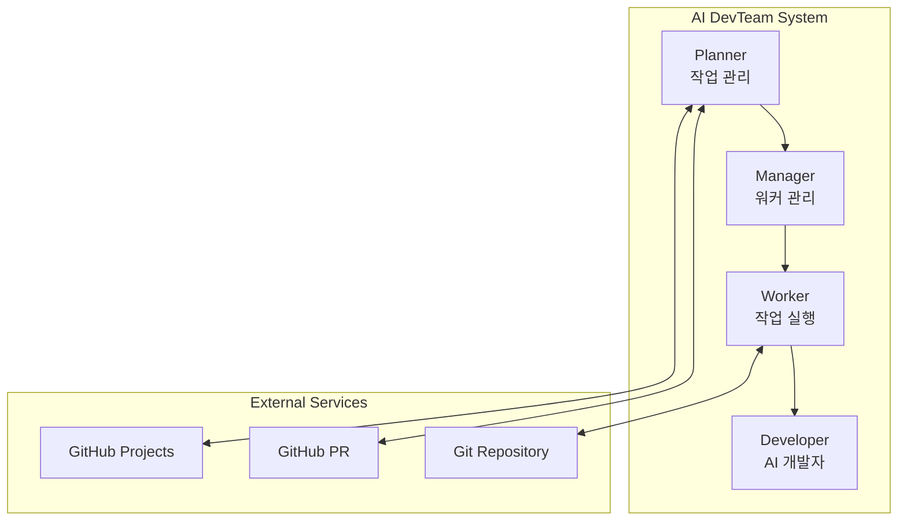

# AI DevTeam Node

[](docs/README.en.md)
[](README.md)
[](LICENSE.md)

AI 개발자(Claude Code, Gemini CLI)를 활용한 자동화 개발 시스템입니다. GitHub Projects의 작업을 자동으로 감지하고, AI 개발자에게 작업을 할당하여 코드를 자동으로 생성하고 PR을 만드는 시스템입니다.

## 🚀 주요 기능

- **자동 작업 관리**: GitHub Projects에서 작업을 자동으로 감지하고 관리
- **AI 개발자 통합**: Claude Code 및 Gemini CLI를 통한 자동 코드 생성
- **PR 자동화**: 작업 완료 후 자동으로 Pull Request 생성 및 리뷰 처리
- **병렬 처리**: 여러 Worker를 통한 동시 작업 처리 (최대 5개)
- **피드백 처리**: PR 리뷰 코멘트를 자동으로 반영
- **워크스페이스 관리**: Git worktree를 활용한 독립적인 작업 환경
- **다중 레포지토리 지원**: 여러 레포지토리의 작업을 동시에 처리
- **레포지토리 필터링**: Whitelist/Blacklist 모드로 작업 대상 제어

## 🏗 아키텍처



### 구성 요소

- **Planner**: GitHub Projects의 작업을 모니터링하고 상태를 관리
- **Manager**: Worker Pool을 관리하고 작업을 할당
- **Worker**: 실제 작업을 수행하고 AI 개발자와 통신
- **Developer**: Claude Code 또는 Gemini CLI를 통한 코드 생성

## 📋 시스템 요구사항

- Node.js 20+
- Git 2.15+ (worktree 기능 필요)
- GitHub CLI (`gh`)
- Docker & Docker Compose (선택사항)
- Claude Code CLI 또는 Gemini CLI

## 🛠 설치

### 1. 저장소 클론

```bash
git clone https://github.com/your-org/ai-devteam-node.git
cd ai-devteam-node
```

### 2. 의존성 설치

```bash
# pnpm 사용 (권장)
pnpm install

# npm 사용
npm install
```

### 3. 필수 도구 설치

#### GitHub CLI 설치
```bash
# macOS
brew install gh

# Linux (Ubuntu/Debian)
curl -fsSL https://cli.github.com/packages/githubcli-archive-keyring.gpg | sudo dd of=/usr/share/keyrings/githubcli-archive-keyring.gpg
echo "deb [arch=$(dpkg --print-architecture) signed-by=/usr/share/keyrings/githubcli-archive-keyring.gpg] https://cli.github.com/packages stable main" | sudo tee /etc/apt/sources.list.d/github-cli.list > /dev/null
sudo apt update && sudo apt install gh

# Windows
winget install --id GitHub.cli

# 인증
gh auth login
```

#### Claude Code 설치
```bash
# npm을 통한 설치
npm install -g @anthropic-ai/claude-code

# 인증
claude login
# 또는 API 키 사용
export ANTHROPIC_API_KEY=your_api_key
```

### 4. 환경 변수 설정

`.env.example` 파일을 복사하여 `.env` 파일을 생성하고 설정합니다:

```bash
cp .env.example .env
```

#### 필수 환경 변수

```bash
# GitHub 설정
GITHUB_TOKEN="your_github_personal_access_token"    # GitHub PAT (repo, project 권한 필요)
GITHUB_OWNER="your_github_username_or_org"          # GitHub 사용자명 또는 조직명
GITHUB_PROJECT_NUMBER="your_project_number"         # GitHub Project 번호

# 저장소 설정 (선택 1: 다중 레포지토리)
GITHUB_REPOS="owner1/repo1,owner2/repo2"           # 작업할 저장소 목록
GITHUB_REPO_FILTER_MODE="whitelist"                # whitelist 또는 blacklist

# 저장소 설정 (선택 2: 단일 레포지토리)
GITHUB_REPO="your_repository_name"                 # 단일 저장소명
```

#### 선택 환경 변수

```bash
# AI 개발자 도구 설정
CLAUDE_CODE_PATH="claude"                          # Claude Code 실행 경로
CLAUDE_CODE_TIMEOUT="300000"                       # 타임아웃 (ms)
GEMINI_CLI_PATH="gemini"                          # Gemini CLI 실행 경로
GEMINI_CLI_TIMEOUT="300000"                       # 타임아웃 (ms)

# Worker Pool 설정
MIN_WORKERS="1"                                    # 최소 Worker 수
MAX_WORKERS="5"                                    # 최대 Worker 수
WORKER_TIMEOUT="600000"                           # Worker 타임아웃 (ms)

# 워크스페이스 설정
WORKSPACE_ROOT="./workspace"                      # 작업 디렉토리 경로
CLONE_DEPTH="1"                                   # Git clone 깊이

# 애플리케이션 설정
NODE_ENV="development"                            # development 또는 production
LOG_LEVEL="info"                                  # error, warn, info, debug
PORT="3000"                                       # 애플리케이션 포트
MONITORING_INTERVAL_MS="30000"                    # 모니터링 주기 (ms)

# PR 코멘트 필터링
ALLOWED_PR_BOTS="sonarcloud[bot],deepsource[bot]" # 허용할 봇 목록
EXCLUDE_PR_AUTHOR="true"                          # PR 작성자 코멘트 제외
```

### GitHub Token 생성 가이드

1. GitHub → Settings → Developer settings → Personal access tokens → Tokens (classic)
2. "Generate new token" 클릭
3. 필요한 권한 선택:
   - `repo` (전체) - 저장소 접근
   - `project` (read:project, write:project) - GitHub Projects 접근
   - `workflow` - GitHub Actions (선택사항)
4. 토큰 생성 후 `.env` 파일에 복사

## 🚀 실행 방법

### 로컬 실행

#### 개발 모드
```bash
pnpm dev
# 또는
npm run dev
```

#### 프로덕션 모드
```bash
# 빌드
pnpm build

# 실행
pnpm start
```

### Docker 실행

#### 방법 1: Docker Hub 이미지 사용 (권장)

Docker Hub에서 사전 빌드된 이미지를 다운로드하여 사용할 수 있습니다:

```bash
# 표준 이미지 다운로드 (Node.js 환경만 포함)
docker pull wlgns5376/ai-devteam:latest

# All-languages 이미지 다운로드 (Python, Go, Java 등 모든 언어 환경 포함)
docker pull wlgns5376/ai-devteam:latest-all-languages
```

##### 이미지 태그 종류

- **표준 이미지** (Dockerfile 기반):
  - `latest`: 최신 버전
  - `vX.Y.Z`: 특정 버전 (예: `v1.0.2`)
  - `vX.Y`: 메이저.마이너 버전 (예: `v1.0`)
  - `vX`: 메이저 버전 (예: `v1`)

- **All-languages 이미지** (Dockerfile.all-languages 기반):
  - `latest-all-languages`: 모든 언어 환경을 포함한 최신 버전
  - `vX.Y.Z-all-languages`: 특정 버전 (예: `v1.0.2-all-languages`)
  - `vX.Y-all-languages`: 메이저.마이너 버전 (예: `v1.0-all-languages`)
  - `vX-all-languages`: 메이저 버전 (예: `v1-all-languages`)

##### 이미지 선택 가이드

- **표준 이미지**를 사용하는 경우:
  - Node.js/TypeScript 프로젝트만 처리하는 경우
  - 이미지 크기를 최소화하고 싶은 경우
  - 빠른 컨테이너 시작이 필요한 경우

- **All-languages 이미지**를 사용하는 경우:
  - 다양한 프로그래밍 언어로 작성된 프로젝트를 처리하는 경우
  - Python, Go, Java, Rust 등의 프로젝트를 함께 관리하는 경우
  - AI 개발자가 여러 언어로 코드를 생성해야 하는 경우

#### 방법 2: 로컬에서 Docker 이미지 빌드

직접 이미지를 빌드하려면:

```bash
# 표준 이미지 빌드
docker build -t ai-devteam:v1.0.2 .

# All-languages 이미지 빌드
docker build -f Dockerfile.all-languages -t ai-devteam:v1.0.2-all-languages .
```

#### Docker Compose 실행

1. Docker 환경 변수 파일 생성:
```bash
cp .env.example .env.docker
# .env.docker 파일 편집하여 환경 변수 설정
```

2. `docker-compose.yml` 파일 생성:
```yaml
version: '3.8'

services:
  ai-devteam:
    # Docker Hub 이미지 사용 (다음 중 선택)
    image: wlgns5376/ai-devteam:latest                 # 표준 이미지
    # image: wlgns5376/ai-devteam:latest-all-languages # 모든 언어 환경 포함
    # image: wlgns5376/ai-devteam:v1.0.2               # 특정 버전
    # image: ai-devteam:<tag>                          # 로컬 빌드 이미지 사용 시
    container_name: ai-devteam
    user: "1001:1001"
    environment:
      - GIT_USER_NAME=your_git_username
      - GIT_USER_EMAIL=your_email@example.com
      - GITHUB_TOKEN=${GITHUB_TOKEN}
      - GIT_ACCEPT_HOST_KEY=true
    volumes:
      - ./.env.docker:/app/.env:ro
      - ./workspace:/workspace
      - ai_devteam_home:/home/appuser
    restart: unless-stopped
    healthcheck:
      test: ["CMD", "node", "-e", "console.log('Health check: OK')"]
      interval: 30s
      timeout: 10s
      retries: 3
      start_period: 60s

volumes:
  ai_devteam_home:
    driver: local
```

3. Docker Compose 실행:
```bash
docker-compose up -d
```

4. 로그 확인:
```bash
docker-compose logs -f ai-devteam
```

## 📚 작업 흐름

### 신규 작업 처리

1. **Planner**가 주기적으로 GitHub Projects에서 TODO 상태의 작업을 확인
2. **Manager**에게 작업을 전달하고 사용 가능한 Worker 확인
3. **Worker**가 작업 디렉토리와 Git worktree 생성
4. **Developer**(AI)에게 작업 내용 전달
5. AI가 코드 생성 및 PR 생성
6. 작업 상태를 IN_REVIEW로 변경

### PR 리뷰 처리

1. **Planner**가 IN_REVIEW 상태의 작업 모니터링
2. PR이 승인되면 자동 병합
3. 피드백이 있으면 Worker를 통해 AI에게 전달하여 수정

## 🧪 테스트

```bash
# 단위 테스트 실행
pnpm test

# 테스트 커버리지 확인
pnpm test:coverage

# 테스트 감시 모드
pnpm test:watch
```

## 🏗 프로젝트 구조

```
ai-devteam-node/
├── src/
│   ├── app/                    # 애플리케이션 핵심 로직
│   │   ├── TaskRequestHandler.ts
│   │   └── WorkerTaskExecutor.ts
│   ├── services/               # 서비스 계층
│   │   ├── planner/           # 작업 계획 관리
│   │   ├── worker/            # Worker 관리
│   │   ├── developer/         # AI 개발자 통합
│   │   ├── git/               # Git 작업 관리
│   │   ├── project-board/     # GitHub Projects 연동
│   │   └── pull-request/      # PR 관리
│   ├── types/                  # TypeScript 타입 정의
│   └── index.ts               # 진입점
├── docs/                       # 문서
│   ├── PRD.md                 # 제품 요구사항 문서
│   └── prd-design-flow.md     # 설계 흐름도
├── tests/                      # 테스트 코드
├── .env.example               # 환경 변수 예제
├── docker-compose.yml         # Docker Compose 설정
└── Dockerfile                 # Docker 이미지 정의
```

## 🔧 개발 가이드

### 코드 스타일

```bash
# ESLint 검사
pnpm lint

# 자동 수정
pnpm lint:fix

# Prettier 포맷팅
pnpm format

# 타입 체크
pnpm typecheck
```

### 빌드

```bash
# TypeScript 컴파일
pnpm build

# 빌드 파일 정리
pnpm clean
```

### 커밋 메시지 규칙

- `feat:` 새로운 기능
- `fix:` 버그 수정
- `docs:` 문서 수정
- `test:` 테스트 추가/수정
- `refactor:` 코드 리팩토링
- `chore:` 빌드, 설정 등

## 🐛 문제 해결

### GitHub 토큰 권한 문제

GitHub Personal Access Token에 다음 권한이 필요합니다:
- `repo` - 저장소 접근
- `project` - GitHub Projects 접근
- `workflow` - GitHub Actions (선택사항)

### Claude Code 인증

Docker 환경에서 Claude Code를 사용하는 경우:
1. 컨테이너에 접속: `docker exec -it ai-devteam /bin/bash`
2. Claude 인증: `claude login`
3. 볼륨 마운트를 통해 인증 정보 영속화

### Worker 타임아웃

작업이 오래 걸리는 경우 `WORKER_TIMEOUT` 환경 변수를 늘려주세요:
```bash
WORKER_TIMEOUT="1800000"  # 30분
```

### Git worktree 오류

Git 버전이 2.15 이상인지 확인:
```bash
git --version

# worktree 목록 확인
cd workspace/repositories/[repo-name]
git worktree list
```

### 로그 확인

```bash
# 로컬 환경
tail -f logs/ai-devteam.log

# Docker 환경
docker-compose logs -f ai-devteam
```

## 📝 라이선스

ISC License - 자세한 내용은 [LICENSE.md](LICENSE.md) 파일을 참조하세요.

## 🤝 기여

프로젝트에 기여하고 싶으시다면 Pull Request를 보내주세요!

1. Fork the Project
2. Create your Feature Branch (`git checkout -b feature/AmazingFeature`)
3. Commit your Changes (`git commit -m 'feat: Add some AmazingFeature'`)
4. Push to the Branch (`git push origin feature/AmazingFeature`)
5. Open a Pull Request

## 📞 문의

이슈가 있거나 질문이 있으시면 GitHub Issues를 통해 문의해주세요.