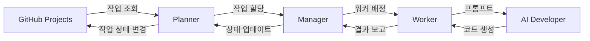

# AI DevTeam

Claude Code와 Gemini CLI 같은 터미널 기반 서비스를 이용한 프로그램 개발 자동화 시스템

## 개요

AI DevTeam은 GitHub Projects와 연동하여 자동으로 개발 작업을 수행하는 시스템입니다. AI 개발자(Claude Code, Gemini CLI)를 활용하여 코드 작성, 리뷰, 병합 등의 개발 과정을 자동화합니다.

본 시스템은 프로젝트 관리 도구의 작업을 AI 개발자에게 자동으로 할당하고, 개발 완료 후 PR 생성부터 리뷰 대응, 병합까지 전체 개발 프로세스를 자동화합니다.

## 주요 기능

- **프로젝트 보드 연동**: GitHub Projects V2 API 지원 (향후 Jira, Notion 확장 예정)
- **다중 레포지토리 지원**: 여러 레포지토리의 작업을 동시에 처리
- **레포지토리 필터링**: Whitelist/Blacklist 모드로 작업 대상 레포지토리 제어
- **소스 코드 관리**: Git worktree를 통한 격리된 작업 환경, GitHub API/CLI 연동
- **AI 개발자 지원**: Claude Code, Gemini CLI 통합
- **워커 풀 관리**: 동적 워커 생성 및 병렬 작업 처리 (최대 5개 동시 작업)
- **상태 관리**: JSON 기반 메타데이터 및 상태 저장 (향후 DB 확장 예정)
- **작업 자동화**: 신규 작업 할당, 진행 중 작업 재개, PR 리뷰 대응, 병합 자동화
- **Git Lock 메커니즘**: 동시 Git 작업 시 충돌 방지
- **실시간 로깅**: Winston 기반 상세 로깅 시스템

## 시스템 아키텍처

### 주요 컴포넌트

#### Planner

- GitHub Projects V2 API를 통한 작업 조회 (주기적 폴링)
- 작업 상태 변경 (Todo → In Progress → In Review → Done)
- PR 승인 여부 및 피드백 모니터링
- Manager와의 작업 통신

#### Manager

- **WorkerPoolManager**: 워커 생성, 할당, 상태 관리
- **WorkspaceManager**: Git 레포지토리 클론 및 워크트리 관리
- **RepositoryManager**: 다중 레포지토리 관리 및 캐싱
- 워커 상태 추적 (IDLE, WAITING, WORKING, FAILED)

#### Worker

- 격리된 작업 환경 생성 (worktree)
- 컨텍스트 파일 관리 (CLAUDE.local.md)
- AI 개발자에게 프롬프트 전달
- 작업 결과 수집 및 보고

#### Developer

- **ClaudeDeveloper**: Claude Code CLI 인터페이스
- **MockDeveloper**: 테스트용 모의 개발자
- 프롬프트 기반 코드 생성 및 수정
- PR 생성 및 피드백 대응

#### 지원 서비스

- **GitService**: Git 작업 래퍼 (simple-git 기반)
- **GitLockService**: 동시 Git 작업 충돌 방지
- **StateManager**: 시스템 상태 영속화
- **Logger**: Winston 기반 구조화된 로깅

### 작업 흐름



## 프로젝트 구조

```
ai-devteam-node/
├── src/
│   ├── app.ts                    # 메인 애플리케이션 클래스
│   ├── index.ts                  # 엔트리 포인트
│   ├── cli/                      # CLI 명령어
│   │   └── commands.ts
│   ├── config/                   # 설정 관리
│   │   ├── app-config.ts
│   │   └── default.json
│   ├── services/                 # 핵심 서비스
│   │   ├── planner.ts           # Planner 구현
│   │   ├── state-manager.ts     # 상태 관리
│   │   ├── logger.ts            # 로깅 서비스
│   │   ├── service-factory.ts   # 서비스 팩토리
│   │   ├── developer/           # AI 개발자 인터페이스
│   │   │   ├── claude-developer.ts
│   │   │   ├── mock-developer.ts
│   │   │   ├── developer-factory.ts
│   │   │   ├── context-file-manager.ts
│   │   │   └── response-parser.ts
│   │   ├── manager/             # 관리자 컴포넌트
│   │   │   ├── worker-pool-manager.ts
│   │   │   ├── workspace-manager.ts
│   │   │   └── repository-manager.ts
│   │   ├── worker/              # 워커 구현
│   │   │   ├── worker.ts
│   │   │   ├── workspace-setup.ts
│   │   │   ├── prompt-generator.ts
│   │   │   └── result-processor.ts
│   │   ├── project-board/       # 프로젝트 보드 연동
│   │   │   └── github/
│   │   │       ├── github-project-board-v2.service.ts
│   │   │       ├── github-graphql-client.ts
│   │   │       └── repository-filter.ts
│   │   ├── pull-request/        # PR 관리
│   │   │   └── github/
│   │   │       └── github-pull-request.service.ts
│   │   └── git/                 # Git 작업
│   │       ├── git.service.ts
│   │       └── git-lock.service.ts
│   └── types/                   # TypeScript 타입 정의
│       ├── index.ts
│       ├── config.types.ts
│       ├── task.types.ts
│       ├── worker.types.ts
│       ├── developer.types.ts
│       ├── manager.types.ts
│       ├── planner.types.ts
│       ├── project-board.types.ts
│       └── pull-request.types.ts
├── tests/                       # 테스트 파일
│   ├── unit/                   # 단위 테스트
│   ├── integration/            # 통합 테스트
│   └── fixtures/               # 테스트 데이터
├── docs/                        # 프로젝트 문서
│   ├── PRD.md                  # 제품 요구사항 문서
│   ├── roadmap.md              # 로드맵
│   └── *.md                    # 기타 설계 문서
├── logs/                        # 로그 파일 (gitignore)
├── workspace/                   # 작업 디렉토리 (gitignore)
└── .taskmaster/                 # Task Master 설정
```

## 설치 및 실행

### 요구사항

- Node.js 20.0.0 이상
- pnpm 8.0.0 이상 (패키지 매니저)
- Git 2.15+ (worktree 기능 필요)
- GitHub Personal Access Token (repo, project 권한 필요)
- Claude CLI (AI 개발자로 사용 시) - [설치 가이드](https://docs.anthropic.com/claude/docs/claude-cli)
- Gemini CLI (AI 개발자로 사용 시, 선택사항)
- GitHub CLI (PR 작업 시 필수) - `gh` 명령어

#### 필수 도구 설치

**pnpm 설치**

```bash
# npm을 통한 설치
npm install -g pnpm

# 또는 standalone installer 사용
curl -fsSL https://get.pnpm.io/install.sh | sh -

# macOS (Homebrew)
brew install pnpm

# Windows (Chocolatey)
choco install pnpm
```

**GitHub CLI 설치**

```bash
# macOS (Homebrew)
brew install gh

# Linux (apt)
curl -fsSL https://cli.github.com/packages/githubcli-archive-keyring.gpg | sudo dd of=/usr/share/keyrings/githubcli-archive-keyring.gpg
echo "deb [arch=$(dpkg --print-architecture) signed-by=/usr/share/keyrings/githubcli-archive-keyring.gpg] https://cli.github.com/packages stable main" | sudo tee /etc/apt/sources.list.d/github-cli.list > /dev/null
sudo apt update
sudo apt install gh

# Windows (winget)
winget install --id GitHub.cli

# 설치 확인 및 인증
gh --version
gh auth login
```

**Claude Code 설치**

```bash
# npm을 통한 설치 (권장)
npm install -g @anthropic-ai/claude-code

# 설치 확인
claude --version

# Claude 인증 설정
claude login  # 브라우저를 통한 인증
# 또는
export ANTHROPIC_API_KEY=your_api_key  # API 키 사용
```

### 설치

```bash
# 의존성 설치
pnpm install

# 환경 변수 설정
cp .env.example .env
# .env 파일을 편집하여 필요한 값을 설정하세요

# 빌드 (TypeScript 컴파일)
pnpm build
```

### 환경 변수 설정

`.env` 파일에서 다음 값들을 설정해야 합니다:

```bash
# ===== 필수 설정 =====
GITHUB_TOKEN=your_github_personal_access_token_here      # GitHub 토큰 (repo, project, workflow 권한 필요)
GITHUB_OWNER=your_github_username_or_organization        # GitHub 사용자명 또는 조직명
GITHUB_PROJECT_NUMBER=your_github_project_number         # GitHub Project 번호 (URL에서 확인 가능)

# ===== 레포지토리 설정 (둘 중 하나 선택) =====
# 방법 1: 다중 레포지토리 (권장)
GITHUB_REPOS=owner1/repo1,owner2/repo2,owner3/repo3
GITHUB_REPO_FILTER_MODE=whitelist  # whitelist: 나열된 레포만 처리, blacklist: 나열된 레포 제외

# 방법 2: 단일 레포지토리 (기존 방식, deprecated)
GITHUB_REPO=your_repository_name

# ===== 개발 도구 설정 =====
CLAUDE_CODE_PATH=claude                   # Claude CLI 실행 경로 (기본값: claude)
CLAUDE_CODE_TIMEOUT=300000               # Claude 실행 타임아웃 (밀리초, 기본값: 5분)
GEMINI_CLI_PATH=gemini                   # Gemini CLI 실행 경로 (선택사항)
GEMINI_CLI_TIMEOUT=300000                # Gemini 실행 타임아웃 (밀리초)

# ===== 워커 풀 설정 =====
MIN_WORKERS=1                            # 최소 워커 수 (기본값: 1)
MAX_WORKERS=5                            # 최대 워커 수 (기본값: 5)
WORKER_TIMEOUT=600000                    # 워커 타임아웃 (밀리초, 기본값: 10분)

# ===== 작업 공간 설정 =====
WORKSPACE_ROOT=./workspace               # 워크스페이스 루트 디렉토리
CLONE_DEPTH=1                           # Git clone depth (기본값: 1)

# ===== 애플리케이션 설정 =====
NODE_ENV=development                     # development 또는 production
LOG_LEVEL=info                          # error, warn, info, debug
LOG_FILE=./logs/ai-devteam.log          # 로그 파일 경로
MONITORING_INTERVAL_MS=30000             # 모니터링 주기 (밀리초)

# ===== PR 코멘트 필터링 설정 =====
ALLOWED_PR_BOTS=sonarcloud[bot],deepsource[bot],codeclimate[bot]  # 허용할 봇 목록
EXCLUDE_PR_AUTHOR=true                   # PR 작성자 코멘트 제외 여부
```

#### 레포지토리 필터링 설정

AI DevTeam은 GitHub Projects에서 특정 레포지토리의 작업만 처리하도록 필터링할 수 있습니다:

**다중 레포지토리 설정 (권장)**

```bash
# 여러 레포지토리를 쉼표로 구분하여 설정
GITHUB_REPOS=myorg/frontend,myorg/backend,myorg/mobile

# 필터 모드 설정
GITHUB_REPO_FILTER_MODE=whitelist  # 지정된 레포지토리만 처리
# 또는
GITHUB_REPO_FILTER_MODE=blacklist  # 지정된 레포지토리 제외하고 처리
```

**단일 레포지토리 설정 (기존 방식)**

```bash
# 하나의 레포지토리만 처리 (하위 호환성)
GITHUB_REPO=my-repository
```

**설정 우선순위**

1. `GITHUB_REPOS` (새로운 방식) - 최우선
2. `GITHUB_REPO` (기존 방식) - `GITHUB_REPOS`가 없을 때 사용
3. 필터 없음 - 모든 레포지토리 처리

**사용 예시**

```bash
# 예시 1: 특정 프로젝트의 프론트엔드, 백엔드만 처리
GITHUB_REPOS=mycompany/web-frontend,mycompany/api-backend
GITHUB_REPO_FILTER_MODE=whitelist

# 예시 2: 특정 레포지토리를 제외하고 모든 레포지토리 처리
GITHUB_REPOS=mycompany/archived-project,mycompany/experimental-repo
GITHUB_REPO_FILTER_MODE=blacklist

# 예시 3: 단일 레포지토리만 처리 (기존 방식)
GITHUB_REPO=main-project
```

#### GitHub Token 생성 가이드

1. GitHub에서 Settings → Developer settings → Personal access tokens → Tokens (classic)
2. "Generate new token" 클릭
3. 필요한 권한 선택:
   - `repo` (전체 선택) - 저장소 접근
   - `project` (read:project, write:project) - GitHub Projects 접근
   - `workflow` - GitHub Actions 워크플로우 실행 (선택사항)
4. 토큰 생성 후 `.env` 파일에 복사

### 실행

```bash
# 개발 모드
pnpm dev

# 프로덕션 빌드 및 실행
pnpm build
pnpm start

# 테스트 실행
pnpm test

# 테스트 (감시 모드)
pnpm test:watch

# 커버리지 확인
pnpm test:coverage
```

### Docker를 통한 실행

Docker 이미지에는 Node.js, Git, GitHub CLI, Claude CLI가 모두 포함되어 있어 별도 설치 없이 사용할 수 있습니다.

```bash
# Docker 이미지 빌드
docker build -t ai-devteam .

# Docker 컨테이너 실행 (기본)
docker run -d \
  --name ai-devteam \
  -v $(pwd)/.env:/app/.env:ro \
  -v $(pwd)/workspace:/workspace \
  -v $(pwd)/logs:/app/logs \
  -e GIT_USER_NAME="AI DevTeam Bot" \
  -e GIT_USER_EMAIL="bot@ai-devteam.com" \
  -e GITHUB_TOKEN="your_github_token_here" \
  ai-devteam

# GitHub CLI 인증이 필요한 경우 (권장)
docker run -d \
  --name ai-devteam \
  -v $(pwd)/.env:/app/.env:ro \
  -v $(pwd)/workspace:/workspace \
  -v $(pwd)/logs:/app/logs \
  -e GIT_USER_NAME="AI DevTeam Bot" \
  -e GIT_USER_EMAIL="bot@ai-devteam.com" \
  -e GITHUB_TOKEN="your_github_token_here" \
  -e ANTHROPIC_API_KEY="your_claude_api_key_here" \
  ai-devteam

# 로그 확인
docker logs -f ai-devteam

# 컨테이너 중지 및 정리
docker stop ai-devteam
docker rm ai-devteam
```

#### Docker Compose 사용 (권장)

`docker-compose.yml` 파일을 생성하여 더 간편하게 관리할 수 있습니다:

```yaml
version: '3.8'

services:
  ai-devteam:
    build: .
    container_name: ai-devteam
    environment:
      - GIT_USER_NAME=AI DevTeam Bot
      - GIT_USER_EMAIL=bot@ai-devteam.com
      - GITHUB_TOKEN=${GITHUB_TOKEN}
      - ANTHROPIC_API_KEY=${ANTHROPIC_API_KEY}
    volumes:
      - ./.env:/app/.env:ro
      - ./workspace:/workspace
      - ./logs:/app/logs
    restart: unless-stopped
```

```bash
# Docker Compose로 실행
docker-compose up -d

# 로그 확인
docker-compose logs -f

# 중지
docker-compose down
```

#### 환경 변수 설정

Docker 실행 시 다음 환경 변수들을 설정해야 합니다:

**필수 환경 변수:**
- `GITHUB_TOKEN`: GitHub Personal Access Token
- `GIT_USER_NAME`: Git commit에 사용할 사용자명
- `GIT_USER_EMAIL`: Git commit에 사용할 이메일

**선택적 환경 변수:**
- `ANTHROPIC_API_KEY`: Claude API 키 (Claude Code 사용 시)
- `GIT_ACCEPT_HOST_KEY=true`: Git SSH 호스트 키 자동 수락 (보안상 주의)

#### 볼륨 마운트 설명

- `./workspace:/workspace`: 작업 디렉토리 (Git 저장소들이 클론됨)
- `./logs:/app/logs`: 로그 파일 저장소
- `./.env:/app/.env:ro`: 환경 설정 파일 (읽기 전용)

### 문제 해결

**Claude CLI 실행 오류**

```bash
# Claude CLI 경로 확인
which claude

# 실행 권한 확인
ls -la $(which claude)

# 수동 실행 테스트
echo "테스트 프롬프트" | claude -p

# API 키 설정 확인 (API 키 사용 시)
echo $ANTHROPIC_API_KEY
```

**GitHub API 권한 오류**

```bash
# GitHub CLI 인증 상태 확인
gh auth status

# 토큰 권한 확인
gh api user -H "Authorization: token YOUR_GITHUB_TOKEN"
```

**Git worktree 오류**

```bash
# Git 버전 확인 (2.15+ 필요)
git --version

# 워크트리 목록 확인
cd repositories/[repo-name]
git worktree list
```

## 개발 가이드

### 코드 스타일

- **언어**: TypeScript (strict mode)
- **패키지 매니저**: pnpm (빠른 설치, 효율적인 디스크 사용)
- **코드 스타일**: ESLint + Prettier
- **테스트**: Jest (커버리지 80% 이상)
- **아키텍처**: SOLID 원칙 준수

#### pnpm 사용 이유

- **빠른 설치**: 심볼릭 링크를 사용하여 npm보다 3배 빠른 설치 속도
- **디스크 효율성**: 글로벌 스토어를 통한 중복 제거로 디스크 공간 절약
- **엄격한 의존성**: phantom dependencies 방지
- **모노레포 지원**: workspace 기능을 통한 멀티 패키지 프로젝트 관리

### 개발 프로세스

1. **TDD 방식**: 테스트 작성 → 구현 → 리팩토링
2. **Given-When-Then 패턴**: 테스트 케이스 작성
3. **Clean Architecture**: 계층별 역할 분리
4. **의존성 주입**: 테스트 가능한 코드 작성

### 스크립트

```bash
pnpm build           # TypeScript 컴파일
pnpm start           # 애플리케이션 실행
pnpm dev             # 개발 모드 실행
pnpm test            # 테스트 실행
pnpm test:watch      # 테스트 감시 모드
pnpm test:coverage   # 커버리지 리포트
pnpm lint            # ESLint 실행
pnpm lint:fix        # ESLint 자동 수정
pnpm format          # Prettier 실행
```

## 작업 시나리오

### 1. 신규 작업 처리

1. **작업 감지**: Planner가 GitHub Projects에서 'Todo' 상태의 새 작업을 감지
2. **워커 할당**: Manager가 유휴(IDLE) 상태의 Worker를 찾아 작업 할당
3. **환경 준비**: Worker가 레포지토리를 클론하고 작업별 worktree 생성
4. **컨텍스트 설정**: CLAUDE.local.md 파일에 작업 컨텍스트 작성
5. **AI 개발**: Developer(Claude/Gemini)가 프롬프트를 받아 코드 작성 및 PR 생성
6. **상태 업데이트**: Planner가 작업 상태를 'In Review'로 변경하고 PR 링크 등록

### 2. 진행 중 작업 재개

1. **상태 확인**: Planner가 'In Progress' 상태의 작업들을 주기적으로 확인
2. **워커 점검**: Manager가 해당 작업의 Worker 상태 확인
3. **작업 재개**: Worker가 중단된 경우, AI Developer에게 재개 프롬프트 전달
4. **진행 상황 추적**: 작업 완료까지 모니터링 지속

### 3. PR 리뷰 처리

1. **승인 모니터링**: Planner가 'In Review' 상태 작업의 PR 승인 여부 확인
2. **승인된 경우**:
   - Manager가 Worker에게 병합 지시
   - Worker가 AI Developer를 통해 PR 병합
   - 작업 상태를 'Done'으로 변경
   - Worker 초기화 및 다음 작업 준비
3. **피드백이 있는 경우**:
   - Planner가 PR 코멘트 수집
   - Worker가 피드백을 AI Developer에게 전달
   - 수정사항 반영 후 재검토 요청

### 4. 오류 처리

- **타임아웃**: 설정된 시간 초과 시 Worker를 FAILED 상태로 변경
- **Git 충돌**: GitLockService를 통해 동시 작업 충돌 방지
- **재시도**: 실패한 작업은 최대 3회까지 재시도

## 향후 계획

### 단기 계획 (v1.1)

- Jira, Notion 프로젝트 보드 지원
- 데이터베이스 기반 상태 관리 (PostgreSQL/MongoDB)
- 웹 대시보드 UI 개발
- 더 많은 AI 개발자 통합 (GitHub Copilot, Amazon CodeWhisperer)
- Docker 컨테이너화

### 중장기 계획

- 분산 워커 시스템 (Kubernetes 기반)
- 머신러닝 기반 작업 우선순위 최적화
- 코드 리뷰 자동화 강화
- 테스트 자동 생성 및 실행
- CI/CD 파이프라인 통합

## 라이선스

ISC

## 기여하기

1. Fork the repository
2. Create a feature branch (`git checkout -b feature/amazing-feature`)
3. Commit your changes (`git commit -m 'feat: add amazing feature'`)
4. Add tests for your changes
5. Ensure tests pass and coverage is maintained (`pnpm test`)
6. Push to the branch (`git push origin feature/amazing-feature`)
7. Submit a pull request

### 커밋 메시지 규칙

- `feat:` 새로운 기능
- `fix:` 버그 수정
- `docs:` 문서 수정
- `test:` 테스트 추가/수정
- `refactor:` 코드 리팩토링
- `chore:` 빌드, 설정 등

## 지원

- **GitHub Issues**: 버그 리포트 및 기능 요청
- **Documentation**: `/docs` 디렉토리의 상세 문서 참조
- **로드맵**: `/docs/roadmap.md` 참조
