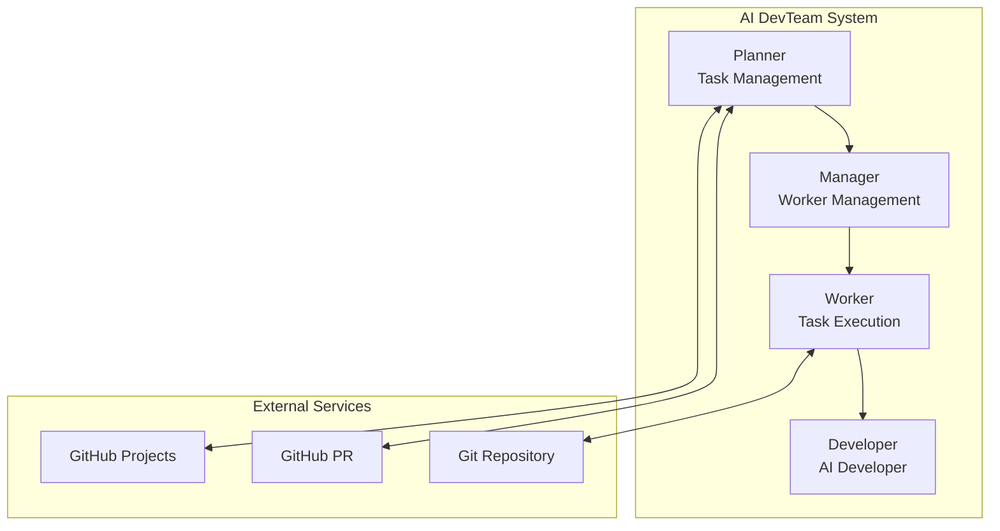

# AI DevTeam Node

An automated development system leveraging AI developers (Claude Code, Gemini CLI). It automatically detects tasks from GitHub Projects, assigns them to AI developers, generates code, and creates pull requests.

## 🚀 Key Features

- **Automated Task Management**: Automatically detect and manage tasks from GitHub Projects
- **AI Developer Integration**: Automated code generation through Claude Code and Gemini CLI
- **PR Automation**: Automatically create Pull Requests and handle reviews after task completion
- **Parallel Processing**: Process multiple tasks simultaneously through multiple Workers (up to 5)
- **Feedback Processing**: Automatically incorporate PR review comments
- **Workspace Management**: Independent work environments using Git worktree
- **Multi-Repository Support**: Process tasks from multiple repositories simultaneously
- **Repository Filtering**: Control target repositories with Whitelist/Blacklist modes

## 🏗 Architecture



### Components

- **Planner**: Monitors tasks in GitHub Projects and manages their status
- **Manager**: Manages Worker Pool and assigns tasks
- **Worker**: Executes actual work and communicates with AI developers
- **Developer**: Code generation through Claude Code or Gemini CLI

## 📋 System Requirements

- Node.js 20+
- Git 2.15+ (worktree feature required)
- GitHub CLI (`gh`)
- Docker & Docker Compose (optional)
- Claude Code CLI or Gemini CLI

## 🛠 Installation

### 1. Clone Repository

```bash
git clone https://github.com/your-org/ai-devteam-node.git
cd ai-devteam-node
```

### 2. Install Dependencies

```bash
# Using pnpm (recommended)
pnpm install

# Using npm
npm install
```

### 3. Install Required Tools

#### Install GitHub CLI
```bash
# macOS
brew install gh

# Linux (Ubuntu/Debian)
curl -fsSL https://cli.github.com/packages/githubcli-archive-keyring.gpg | sudo dd of=/usr/share/keyrings/githubcli-archive-keyring.gpg
echo "deb [arch=$(dpkg --print-architecture) signed-by=/usr/share/keyrings/githubcli-archive-keyring.gpg] https://cli.github.com/packages stable main" | sudo tee /etc/apt/sources.list.d/github-cli.list > /dev/null
sudo apt update && sudo apt install gh

# Windows
winget install --id GitHub.cli

# Authentication
gh auth login
```

#### Install Claude Code
```bash
# Install via npm
npm install -g @anthropic-ai/claude-code

# Authentication
claude login
# Or use API key
export ANTHROPIC_API_KEY=your_api_key
```

### 4. Environment Variables Setup

Copy `.env.example` to create `.env` file and configure:

```bash
cp .env.example .env
```

#### Required Environment Variables

```bash
# GitHub Configuration
GITHUB_TOKEN="your_github_personal_access_token"    # GitHub PAT (repo, project permissions required)
GITHUB_OWNER="your_github_username_or_org"          # GitHub username or organization
GITHUB_PROJECT_NUMBER="your_project_number"         # GitHub Project number

# Repository Configuration (Option 1: Multiple Repositories)
GITHUB_REPOS="owner1/repo1,owner2/repo2"           # List of repositories to work with
GITHUB_REPO_FILTER_MODE="whitelist"                # whitelist or blacklist

# Repository Configuration (Option 2: Single Repository)
GITHUB_REPO="your_repository_name"                 # Single repository name
```

#### Optional Environment Variables

```bash
# AI Developer Tools Configuration
CLAUDE_CODE_PATH="claude"                          # Claude Code executable path
CLAUDE_CODE_TIMEOUT="300000"                       # Timeout (ms)
GEMINI_CLI_PATH="gemini"                          # Gemini CLI executable path
GEMINI_CLI_TIMEOUT="300000"                       # Timeout (ms)

# Worker Pool Configuration
MIN_WORKERS="1"                                    # Minimum number of workers
MAX_WORKERS="5"                                    # Maximum number of workers
WORKER_TIMEOUT="600000"                           # Worker timeout (ms)

# Workspace Configuration
WORKSPACE_ROOT="./workspace"                      # Working directory path
CLONE_DEPTH="1"                                   # Git clone depth

# Application Configuration
NODE_ENV="development"                            # development or production
LOG_LEVEL="info"                                  # error, warn, info, debug
PORT="3000"                                       # Application port
MONITORING_INTERVAL_MS="30000"                    # Monitoring interval (ms)

# PR Comment Filtering
ALLOWED_PR_BOTS="sonarcloud[bot],deepsource[bot]" # List of allowed bots
EXCLUDE_PR_AUTHOR="true"                          # Exclude PR author comments
```

### GitHub Token Generation Guide

1. Go to GitHub → Settings → Developer settings → Personal access tokens → Tokens (classic)
2. Click "Generate new token"
3. Select required permissions:
   - `repo` (full) - Repository access
   - `project` (read:project, write:project) - GitHub Projects access
   - `workflow` - GitHub Actions (optional)
4. Copy the generated token to `.env` file

## 🚀 Running the Application

### Local Execution

#### Development Mode
```bash
pnpm dev
# or
npm run dev
```

#### Production Mode
```bash
# Build
pnpm build

# Run
pnpm start
```

### Docker Execution

#### Build Docker Image
```bash
docker build -t ai-devteam:v1.0.2 .
```

#### Docker Compose Execution

1. Create Docker environment variables file:
```bash
cp .env.example .env.docker
# Edit .env.docker file to set environment variables
```

2. Create `docker-compose.yml` file:
```yaml
version: '3.8'

services:
  ai-devteam:
    image: ai-devteam:v1.0.2
    container_name: ai-devteam
    user: "1001:1001"
    environment:
      - GIT_USER_NAME=your_git_username
      - GIT_USER_EMAIL=your_email@example.com
      - GITHUB_TOKEN=${GITHUB_TOKEN}
      - GIT_ACCEPT_HOST_KEY=true
    volumes:
      - ./.env.docker:/app/.env:ro
      - ./workspace:/workspace
      - ai_devteam_home:/home/appuser
    restart: unless-stopped
    healthcheck:
      test: ["CMD", "node", "-e", "console.log('Health check: OK')"]
      interval: 30s
      timeout: 10s
      retries: 3
      start_period: 60s

volumes:
  ai_devteam_home:
    driver: local
```

3. Run Docker Compose:
```bash
docker-compose up -d
```

4. Check logs:
```bash
docker-compose logs -f ai-devteam
```

## 📚 Workflow

### New Task Processing

1. **Planner** periodically checks for TODO status tasks in GitHub Projects
2. Passes tasks to **Manager** and checks for available Workers
3. **Worker** creates working directory and Git worktree
4. Passes task content to **Developer** (AI)
5. AI generates code and creates PR
6. Changes task status to IN_REVIEW

### PR Review Processing

1. **Planner** monitors tasks in IN_REVIEW status
2. Automatically merges when PR is approved
3. If there's feedback, passes it to AI through Worker for modifications

## 🧪 Testing

```bash
# Run unit tests
pnpm test

# Check test coverage
pnpm test:coverage

# Test watch mode
pnpm test:watch
```

## 🏗 Project Structure

```
ai-devteam-node/
├── src/
│   ├── app/                    # Application core logic
│   │   ├── TaskRequestHandler.ts
│   │   └── WorkerTaskExecutor.ts
│   ├── services/               # Service layer
│   │   ├── planner/           # Task planning management
│   │   ├── worker/            # Worker management
│   │   ├── developer/         # AI developer integration
│   │   ├── git/               # Git operations management
│   │   ├── project-board/     # GitHub Projects integration
│   │   └── pull-request/      # PR management
│   ├── types/                  # TypeScript type definitions
│   └── index.ts               # Entry point
├── docs/                       # Documentation
│   ├── PRD.md                 # Product Requirements Document
│   └── prd-design-flow.md     # Design flow diagram
├── tests/                      # Test code
├── .env.example               # Environment variables example
├── docker-compose.yml         # Docker Compose configuration
└── Dockerfile                 # Docker image definition
```

## 🔧 Development Guide

### Code Style

```bash
# ESLint check
pnpm lint

# Auto fix
pnpm lint:fix

# Prettier formatting
pnpm format

# Type check
pnpm typecheck
```

### Build

```bash
# TypeScript compilation
pnpm build

# Clean build files
pnpm clean
```

### Commit Message Convention

- `feat:` New feature
- `fix:` Bug fix
- `docs:` Documentation update
- `test:` Test addition/modification
- `refactor:` Code refactoring
- `chore:` Build, configuration, etc.

## 🐛 Troubleshooting

### GitHub Token Permission Issues

GitHub Personal Access Token requires the following permissions:
- `repo` - Repository access
- `project` - GitHub Projects access
- `workflow` - GitHub Actions (optional)

### Claude Code Authentication

When using Claude Code in Docker environment:
1. Access container: `docker exec -it ai-devteam /bin/bash`
2. Claude authentication: `claude login`
3. Persist authentication information through volume mount

### Worker Timeout

If tasks take a long time, increase the `WORKER_TIMEOUT` environment variable:
```bash
WORKER_TIMEOUT="1800000"  # 30 minutes
```

### Git worktree Errors

Check Git version is 2.15 or higher:
```bash
git --version

# Check worktree list
cd workspace/repositories/[repo-name]
git worktree list
```

### Log Checking

```bash
# Local environment
tail -f logs/ai-devteam.log

# Docker environment
docker-compose logs -f ai-devteam
```

## 📝 License

ISC License - See [LICENSE.md](../LICENSE.md) for details

## 🤝 Contributing

We welcome contributions! Please submit a Pull Request.

1. Fork the Project
2. Create your Feature Branch (`git checkout -b feature/AmazingFeature`)
3. Commit your Changes (`git commit -m 'feat: Add some AmazingFeature'`)
4. Push to the Branch (`git push origin feature/AmazingFeature`)
5. Open a Pull Request

## 📞 Contact

If you have any issues or questions, please contact us through GitHub Issues.