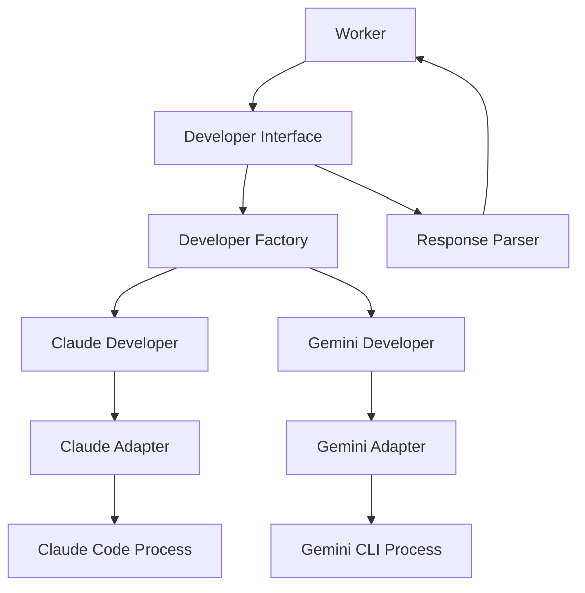

# Developer 인터페이스 설계

## 개요
Developer 인터페이스는 AI DevTeam 시스템에서 실제 AI 개발자(Claude Code, Gemini CLI 등)와 통신하는 핵심 컴포넌트입니다. Worker 컴포넌트가 생성한 프롬프트를 AI 개발자에게 전달하고, 작업 결과를 수집하는 역할을 담당합니다.

## 아키텍처



## 인터페이스 정의

### DeveloperInterface
```typescript
interface DeveloperInterface {
  // 프롬프트를 실행하고 결과를 반환
  executePrompt(prompt: string, workspaceDir: string): Promise<DeveloperOutput>;
  
  // 개발자 프로세스 초기화
  initialize(): Promise<void>;
  
  // 개발자 프로세스 정리
  cleanup(): Promise<void>;
  
  // 상태 확인
  isAvailable(): Promise<boolean>;
  
  // 타임아웃 설정
  setTimeout(timeoutMs: number): void;
}
```

### DeveloperOutput
```typescript
interface DeveloperOutput {
  // AI 응답 전체 내용
  rawOutput: string;
  
  // 파싱된 결과
  result: {
    success: boolean;
    prLink?: string;
    commitHash?: string;
    error?: string;
  };
  
  // 실행된 명령어들
  executedCommands: Command[];
  
  // 수정된 파일 목록
  modifiedFiles: string[];
  
  // 실행 메타데이터
  metadata: {
    startTime: Date;
    endTime: Date;
    duration: number;
    developerType: 'claude' | 'gemini';
  };
}
```

### Command
```typescript
interface Command {
  command: string;
  output: string;
  exitCode: number;
  timestamp: Date;
}
```

## 구현 컴포넌트

### 1. DeveloperFactory
```typescript
class DeveloperFactory {
  static create(
    type: 'claude' | 'gemini',
    config: DeveloperConfig,
    dependencies: DeveloperDependencies
  ): DeveloperInterface {
    switch (type) {
      case 'claude':
        return new ClaudeDeveloper(config, dependencies);
      case 'gemini':
        return new GeminiDeveloper(config, dependencies);
      default:
        throw new Error(`Unsupported developer type: ${type}`);
    }
  }
}
```

### 2. ClaudeDeveloper
Claude Code와 통신하는 구체적인 구현체

```typescript
class ClaudeDeveloper implements DeveloperInterface {
  private process: ChildProcess | null = null;
  private config: ClaudeConfig;
  
  async initialize(): Promise<void> {
    // Claude Code 프로세스 시작
    this.process = spawn('claude', ['--headless'], {
      cwd: this.config.workspaceDir,
      env: {
        ...process.env,
        CLAUDE_API_KEY: this.config.apiKey
      }
    });
  }
  
  async executePrompt(prompt: string, workspaceDir: string): Promise<DeveloperOutput> {
    // 1. 워크스페이스로 이동
    await this.changeDirectory(workspaceDir);
    
    // 2. 프롬프트 전송
    const response = await this.sendPrompt(prompt);
    
    // 3. 응답 파싱
    return this.parseResponse(response);
  }
}
```

### 3. GeminiDeveloper
Gemini CLI와 통신하는 구체적인 구현체

```typescript
class GeminiDeveloper implements DeveloperInterface {
  private config: GeminiConfig;
  
  async executePrompt(prompt: string, workspaceDir: string): Promise<DeveloperOutput> {
    // Gemini CLI 명령 실행
    const result = await exec(`gemini "${prompt}"`, {
      cwd: workspaceDir,
      env: {
        ...process.env,
        GEMINI_API_KEY: this.config.apiKey
      }
    });
    
    return this.parseResponse(result);
  }
}
```

### 4. ResponseParser
AI 응답에서 필요한 정보를 추출하는 파서

```typescript
class ResponseParser {
  // PR 링크 추출
  extractPrLink(output: string): string | undefined {
    const prRegex = /https:\/\/github\.com\/[\w-]+\/[\w-]+\/pull\/\d+/g;
    const matches = output.match(prRegex);
    return matches ? matches[0] : undefined;
  }
  
  // 커밋 해시 추출
  extractCommitHash(output: string): string | undefined {
    const commitRegex = /\b[0-9a-f]{40}\b/g;
    const matches = output.match(commitRegex);
    return matches ? matches[0] : undefined;
  }
  
  // 실행된 명령어 추출
  extractCommands(output: string): Command[] {
    // AI 출력에서 실행된 명령어와 결과 파싱
    const commands: Command[] = [];
    // 파싱 로직...
    return commands;
  }
}
```

### 5. ProcessManager
AI 프로세스 생명주기 관리

```typescript
class ProcessManager {
  private processes: Map<string, ChildProcess> = new Map();
  
  async spawn(
    command: string, 
    args: string[], 
    options: SpawnOptions
  ): Promise<ChildProcess> {
    const process = spawn(command, args, options);
    this.processes.set(process.pid.toString(), process);
    return process;
  }
  
  async kill(pid: string): Promise<void> {
    const process = this.processes.get(pid);
    if (process) {
      process.kill();
      this.processes.delete(pid);
    }
  }
  
  async killAll(): Promise<void> {
    for (const [pid, process] of this.processes) {
      process.kill();
    }
    this.processes.clear();
  }
}
```

## 설정 구조

### DeveloperConfig
```typescript
interface DeveloperConfig {
  // 공통 설정
  timeoutMs: number;
  maxRetries: number;
  retryDelayMs: number;
  
  // Claude 설정
  claude?: {
    apiKey: string;
    model?: string;
    maxTokens?: number;
    temperature?: number;
  };
  
  // Gemini 설정
  gemini?: {
    apiKey: string;
    model?: string;
    maxTokens?: number;
    temperature?: number;
  };
}
```

## 에러 처리

### DeveloperError
```typescript
class DeveloperError extends Error {
  constructor(
    message: string,
    public code: DeveloperErrorCode,
    public developerType: 'claude' | 'gemini',
    public context?: any
  ) {
    super(message);
  }
}

enum DeveloperErrorCode {
  INITIALIZATION_FAILED = 'DEVELOPER_INIT_FAILED',
  EXECUTION_FAILED = 'DEVELOPER_EXEC_FAILED',
  TIMEOUT = 'DEVELOPER_TIMEOUT',
  PARSE_ERROR = 'DEVELOPER_PARSE_ERROR',
  PROCESS_CRASHED = 'DEVELOPER_PROCESS_CRASHED'
}
```

## 통합 흐름

1. **초기화**
   - Worker가 Developer 인스턴스 생성 요청
   - DeveloperFactory가 적절한 Developer 구현체 생성
   - Developer가 AI 프로세스 초기화

2. **프롬프트 실행**
   - Worker가 프롬프트와 워크스페이스 정보 전달
   - Developer가 AI 프로세스에 프롬프트 전송
   - AI가 작업 수행 (코드 작성, PR 생성 등)
   - Developer가 응답 수집 및 파싱

3. **결과 처리**
   - ResponseParser가 AI 출력 분석
   - PR 링크, 커밋 정보 추출
   - 실행된 명령어 목록 수집
   - 구조화된 결과 반환

4. **정리**
   - 작업 완료 후 프로세스 정리
   - 리소스 해제

## 보안 고려사항

1. **API 키 관리**
   - 환경 변수로 API 키 전달
   - 로그에 API 키 노출 방지

2. **프로세스 격리**
   - 각 Worker별 독립적인 프로세스
   - 워크스페이스 격리

3. **명령어 실행 제한**
   - 허용된 명령어만 실행
   - 위험한 명령어 차단

## 모니터링

1. **메트릭 수집**
   - 프롬프트 실행 시간
   - 성공/실패율
   - API 사용량

2. **로깅**
   - 모든 프롬프트와 응답 기록
   - 에러 상황 상세 로깅

## 확장성

1. **새로운 AI 개발자 추가**
   - DeveloperInterface 구현
   - Factory에 등록
   - 설정 스키마 추가

2. **기능 확장**
   - 스트리밍 응답 지원
   - 멀티모달 입력 지원
   - 컨텍스트 관리