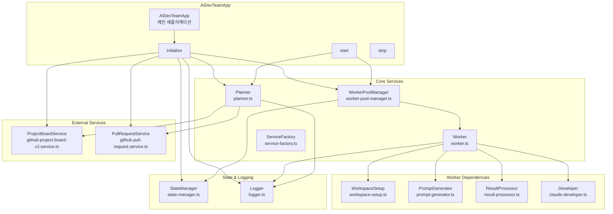
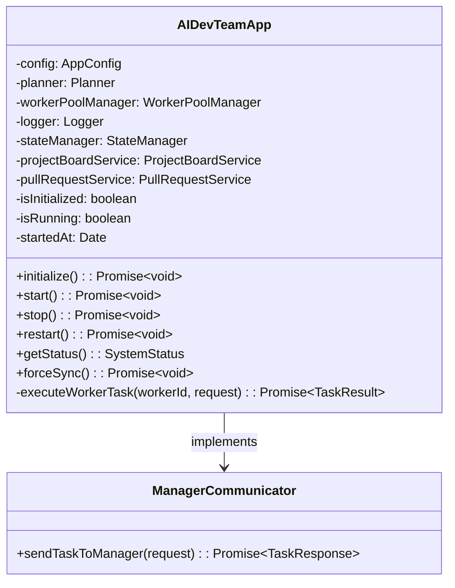
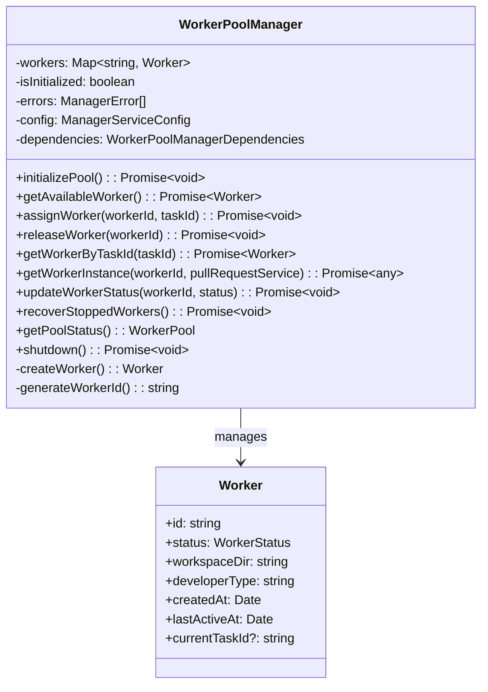
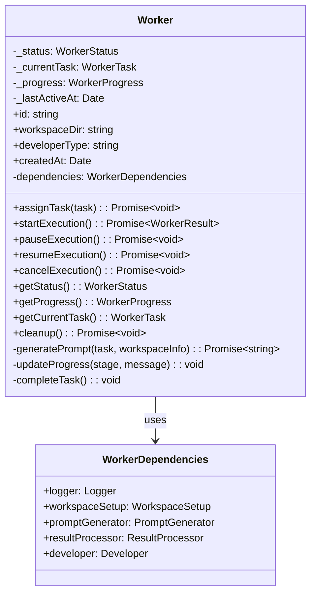
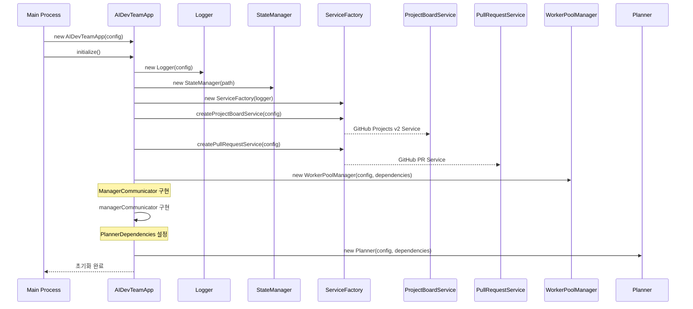
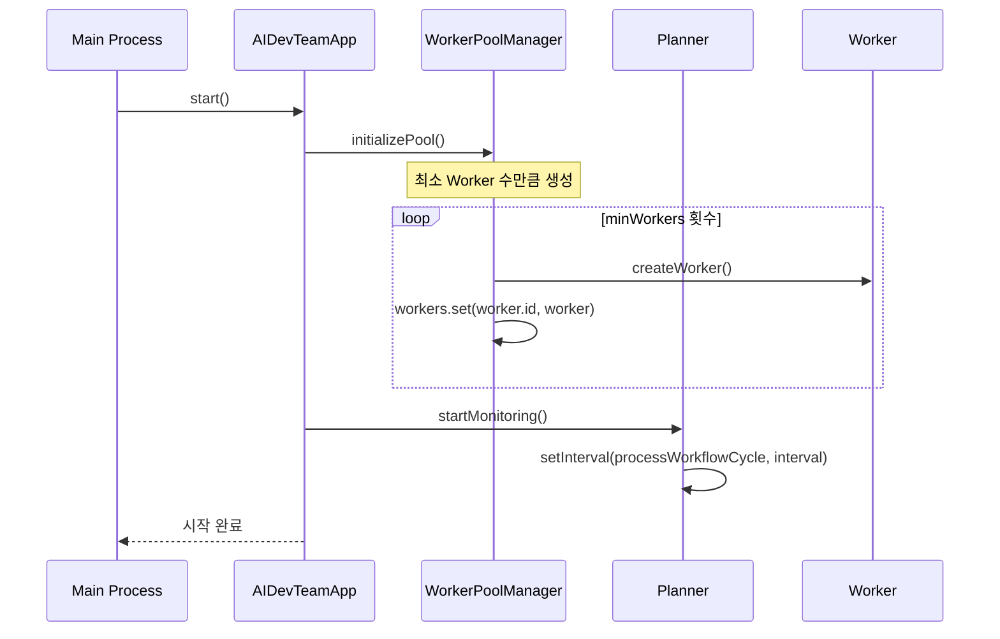
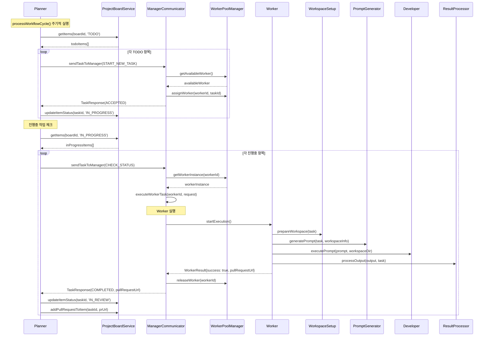
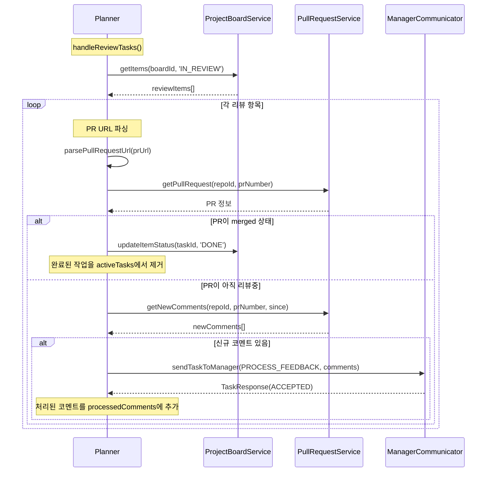

# 실제 구현 흐름도

## 전체 시스템 아키텍처 (구현된 코드 기준)



## 클래스 구조 및 의존성

### AIDevTeamApp (app.ts)



### Planner (planner.ts)

```mermaid
classDiagram
    class Planner {
        -monitoringTimer: NodeJS.Timeout
        -workflowState: WorkflowState
        -errors: PlannerError[]
        -totalTasksProcessed: number
        -config: PlannerServiceConfig
        -dependencies: PlannerDependencies
        
        +startMonitoring(): Promise~void~
        +stopMonitoring(): Promise~void~
        +processWorkflowCycle(): Promise~void~
        +handleNewTasks(): Promise~void~
        +handleInProgressTasks(): Promise~void~
        +handleReviewTasks(): Promise~void~
        +getStatus(): PlannerStatus
        +forceSync(): Promise~void~
        -parsePullRequestUrl(url): {repoId, prNumber}
        -addError(code, message, context): void
    }
    
    class WorkflowState {
        +processedTasks: Set~string~
        +processedComments: Set~string~
        +activeTasks: Map~string, TaskInfo~
        +lastSyncTime?: Date
    }
    
    Planner --> WorkflowState : contains
```

### WorkerPoolManager (worker-pool-manager.ts)



### Worker (worker.ts)



## 실제 실행 흐름

### 1. 시스템 초기화 흐름



### 2. 시스템 시작 흐름



### 3. 작업 처리 흐름 (실제 구현)



### 4. PR 리뷰 처리 흐름



## 주요 특징 및 구현 세부사항

### 1. 비동기 처리 및 상태 관리
- 모든 작업이 Promise 기반 비동기 처리
- WorkflowState를 통한 작업 상태 추적
- Set과 Map을 활용한 중복 처리 방지

### 2. Error Handling
- 각 서비스별 Error 타입 정의
- 에러 로깅 및 재시도 메커니즘
- Graceful shutdown 지원

### 3. Worker Pool 관리
- 동적 Worker 생성/제거
- Worker 상태 추적 (IDLE, WAITING, WORKING, STOPPED)
- Worker 복구 메커니즘

### 4. 확장 가능한 아키텍처
- ServiceFactory를 통한 서비스 생성
- 인터페이스 기반 의존성 주입
- 설정 기반 동작 제어

### 5. 상태 지속성
- StateManager를 통한 JSON 기반 상태 저장
- Worker 및 작업 정보 지속화

### 6. 로깅 시스템
- 구조화된 로깅 (Logger 클래스)
- 다양한 로그 레벨 지원
- 파일 및 콘솔 출력 지원

## Mock 구현 특징

### WorkerPoolManager의 getWorkerInstance
- 실제 Worker 인스턴스 대신 Mock 객체 반환
- 간단한 작업 시뮬레이션 (1-3초 대기)
- Mock PR 생성 및 URL 반환

### 실제 구현에서 필요한 추가 작업
- 실제 WorkspaceSetup 구현
- 실제 PromptGenerator 구현  
- 실제 ResultProcessor 구현
- 실제 Developer (Claude Code) 통합
- Git worktree 실제 관리 로직

이 구현은 전체 시스템의 골격을 제공하며, Mock 서비스를 통해 전체 흐름을 테스트할 수 있는 구조로 되어있습니다.