# 실제 구현 흐름도

## 전체 시스템 아키텍처 (구현된 코드 기준)

```mermaid
graph TB
    subgraph "AIDevTeamApp (app.ts)"
        APP[AIDevTeamApp<br/>메인 애플리케이션]
        APP_INIT[initialize]
        APP_START[start]
        APP_STOP[stop]
        MC[ManagerCommunicator<br/>구현체]
    end
    
    subgraph "Core Services"
        PL[Planner<br/>planner.ts]
        WPM[WorkerPoolManager<br/>worker-pool-manager.ts]
        WK[Worker<br/>worker.ts]
        SF[ServiceFactory<br/>service-factory.ts]
    end
    
    subgraph "External Services"
        PBS[ProjectBoardService<br/>github-project-board-v2.service.ts]
        PRS[PullRequestService<br/>github-pull-request.service.ts]
        GHGQL[GitHubGraphQLClient<br/>github-graphql-client.ts]
    end
    
    subgraph "Worker Dependencies"
        WS[WorkspaceSetup<br/>workspace-setup.ts]
        PG[PromptGenerator<br/>prompt-generator.ts]
        RP[ResultProcessor<br/>result-processor.ts]
        DEV[Developer<br/>claude-developer.ts/mock-developer.ts]
        DF[DeveloperFactory<br/>developer-factory.ts]
    end
    
    subgraph "State & Logging"
        SM[StateManager<br/>state-manager.ts]
        LOG[Logger<br/>logger.ts]
    end
    
    subgraph "Configuration & Types"
        CFG[AppConfig<br/>app-config.ts]
        TYPES[Types<br/>*.types.ts]
    end
    
    APP --> APP_INIT
    APP_INIT --> PL
    APP_INIT --> WPM
    APP_INIT --> PBS
    APP_INIT --> PRS
    APP_INIT --> SM
    APP_INIT --> LOG
    APP_INIT --> MC
    
    APP_START --> WPM
    APP_START --> PL
    
    PL --> MC
    MC --> WPM
    PL --> PBS
    PL --> PRS
    WPM --> WK
    WK --> WS
    WK --> PG
    WK --> RP
    WK --> DEV
    
    SF --> PBS
    SF --> PRS
    PBS --> GHGQL
    DF --> DEV
    
    WPM --> SM
    WK --> LOG
    PL --> LOG
    PBS --> LOG
    PRS --> LOG
    
    APP --> CFG
    ALL --> TYPES
```



## 클래스 구조 및 의존성

### AIDevTeamApp (app.ts)


### Planner (planner.ts)

```mermaid
classDiagram
    class Planner {
        -monitoringTimer: NodeJS.Timeout
        -workflowState: WorkflowState
        -errors: PlannerError[]
        -totalTasksProcessed: number
        -config: PlannerServiceConfig
        -dependencies: PlannerDependencies
        
        +startMonitoring(): Promise~void~
        +stopMonitoring(): Promise~void~
        +processWorkflowCycle(): Promise~void~
        +handleNewTasks(): Promise~void~
        +handleInProgressTasks(): Promise~void~
        +handleReviewTasks(): Promise~void~
        +getStatus(): PlannerStatus
        +forceSync(): Promise~void~
        -parsePullRequestUrl(url): {repoId, prNumber}
        -addError(code, message, context): void
    }
    
    class WorkflowState {
        +processedTasks: Set~string~
        +processedComments: Set~string~
        +activeTasks: Map~string, TaskInfo~
        +lastSyncTime?: Date
    }
    
    Planner --> WorkflowState : contains
```

### WorkerPoolManager (worker-pool-manager.ts)


### Worker (worker.ts)


## 실제 실행 흐름

### 1. 시스템 초기화 흐름

```mermaid
sequenceDiagram
    participant MAIN as Main Process
    participant APP as AIDevTeamApp
    participant LOG as Logger
    participant SM as StateManager
    participant SF as ServiceFactory
    participant PBS as ProjectBoardService
    participant PRS as PullRequestService
    participant WPM as WorkerPoolManager
    participant PL as Planner
    
    MAIN->>APP: new AIDevTeamApp(config)
    MAIN->>APP: initialize()
    
    APP->>LOG: new Logger(config)
    APP->>SM: new StateManager(path)
    APP->>SF: new ServiceFactory(logger)
    APP->>SF: createProjectBoardService(config)
    SF-->>PBS: GitHub Projects v2 Service
    APP->>SF: createPullRequestService(config)
    SF-->>PRS: GitHub PR Service
    
    APP->>WPM: new WorkerPoolManager(config, dependencies)
    
    Note over APP: ManagerCommunicator 구현
    APP->>APP: managerCommunicator 구현
    
    Note over APP: PlannerDependencies 설정
    APP->>PL: new Planner(config, dependencies)
    
    APP-->>MAIN: 초기화 완료
```



### 2. 시스템 시작 흐름

```mermaid
sequenceDiagram
    participant MAIN as Main Process
    participant APP as AIDevTeamApp
    participant WPM as WorkerPoolManager
    participant PL as Planner
    participant WK as Worker
    
    MAIN->>APP: start()
    
    APP->>WPM: initializePool()
    
    Note over WPM: 최소 Worker 수만큼 생성
    loop minWorkers 횟수
        WPM->>WK: createWorker()
        WPM->>WPM: workers.set(worker.id, worker)
    end
    
    APP->>PL: startMonitoring()
    PL->>PL: setInterval(processWorkflowCycle, interval)
    
    APP-->>MAIN: 시작 완료
```



### 3. 작업 처리 흐름 (실제 구현)

```mermaid
sequenceDiagram
    participant PL as Planner
    participant PBS as ProjectBoardService
    participant MC as ManagerCommunicator
    participant WPM as WorkerPoolManager
    participant WK as Worker
    participant WS as WorkspaceSetup
    participant PG as PromptGenerator
    participant DEV as Developer
    participant RP as ResultProcessor
    
    Note over PL: processWorkflowCycle() 주기적 실행
    
    PL->>PBS: getItems(boardId, 'TODO')
    PBS-->>PL: todoItems[]
    
    loop 각 TODO 항목
        PL->>MC: sendTaskToManager(START_NEW_TASK)
        MC->>WPM: getAvailableWorker()
        WPM-->>MC: availableWorker
        MC->>WPM: assignWorker(workerId, taskId)
        MC-->>PL: TaskResponse(ACCEPTED)
        
        PL->>PBS: updateItemStatus(taskId, 'IN_PROGRESS')
    end
    
    Note over PL: 진행중 작업 체크
    PL->>PBS: getItems(boardId, 'IN_PROGRESS')
    PBS-->>PL: inProgressItems[]
    
    loop 각 진행중 항목
        PL->>MC: sendTaskToManager(CHECK_STATUS)
        MC->>WPM: getWorkerInstance(workerId)
        WPM-->>MC: workerInstance
        MC->>MC: executeWorkerTask(workerId, request)
        
        Note over MC: Worker 실행
        MC->>WK: startExecution()
        WK->>WS: prepareWorkspace(task)
        WK->>PG: generatePrompt(task, workspaceInfo)
        WK->>DEV: executePrompt(prompt, workspaceDir)
        WK->>RP: processOutput(output, task)
        
        WK-->>MC: WorkerResult{success: true, pullRequestUrl}
        MC->>WPM: releaseWorker(workerId)
        MC-->>PL: TaskResponse(COMPLETED, pullRequestUrl)
        
        PL->>PBS: updateItemStatus(taskId, 'IN_REVIEW')
        PL->>PBS: addPullRequestToItem(taskId, prUrl)
    end
```



### 4. PR 리뷰 처리 흐름

```mermaid
sequenceDiagram
    participant PL as Planner
    participant PBS as ProjectBoardService
    participant PRS as PullRequestService
    participant MC as ManagerCommunicator
    
    Note over PL: handleReviewTasks()
    PL->>PBS: getItems(boardId, 'IN_REVIEW')
    PBS-->>PL: reviewItems[]
    
    loop 각 리뷰 항목
        Note over PL: PR URL 파싱
        PL->>PL: parsePullRequestUrl(prUrl)
        
        PL->>PRS: getPullRequest(repoId, prNumber)
        PRS-->>PL: PR 정보
        
        alt PR이 merged 상태
            PL->>PBS: updateItemStatus(taskId, 'DONE')
            Note over PL: 완료된 작업을 activeTasks에서 제거
        else PR이 아직 리뷰중
            PL->>PRS: getNewComments(repoId, prNumber, since)
            PRS-->>PL: newComments[]
            
            alt 신규 코멘트 있음
                PL->>MC: sendTaskToManager(PROCESS_FEEDBACK, comments)
                MC-->>PL: TaskResponse(ACCEPTED)
                Note over PL: 처리된 코멘트를 processedComments에 추가
            end
        end
    end
```



## 주요 특징 및 구현 세부사항

### 1. 비동기 처리 및 상태 관리
- 모든 작업이 Promise 기반 비동기 처리
- WorkflowState를 통한 작업 상태 추적 (processedTasks, processedComments, activeTasks)
- Set과 Map을 활용한 중복 처리 방지
- StateManager를 통한 Worker 및 작업 정보 지속화

### 2. Error Handling
- 각 서비스별 Error 타입 정의 (PlannerError, ManagerError)
- 에러 로깅 및 재시도 메커니즘
- Graceful shutdown 지원 (SIGTERM, SIGINT 핸들러)
- 에러 개수 제한 (최대 100개, 50개로 자동 축소)

### 3. Worker Pool 관리
- 동적 Worker 생성/제거 (minWorkers ~ maxWorkers)
- Worker 상태 추적 (IDLE, WAITING, WORKING, STOPPED)
- Worker 복구 메커니즘 (recoverStoppedWorkers)
- 작업별 Worker 할당 및 해제

### 4. 확장 가능한 아키텍처
- ServiceFactory를 통한 서비스 생성 (GitHub v2 기반)
- 인터페이스 기반 의존성 주입
- 설정 기반 동작 제어 (AppConfig)
- DeveloperFactory를 통한 개발자 구현체 선택

### 5. GitHub 통합
- GitHub Projects v2 API 지원 (GraphQL 기반)
- GitHub Pull Request API 지원
- Repository 필터링 기능
- PR 상태 추적 및 코멘트 처리

### 6. 로깅 시스템
- 구조화된 로깅 (Logger 클래스)
- 다양한 로그 레벨 지원 (DEBUG, INFO, WARN, ERROR)
- 파일 및 콘솔 출력 지원
- 컨텍스트 정보 포함

## 현재 구현 상태

### ✅ 완전 구현됨
- **AIDevTeamApp**: 메인 애플리케이션 및 초기화 로직
- **Planner**: 전체 워크플로우 관리 (신규/진행중/리뷰 작업 처리)
- **WorkerPoolManager**: Worker 풀 관리 및 작업 할당
- **Worker**: 작업 실행 및 상태 관리
- **ServiceFactory**: GitHub 서비스 생성
- **Logger**: 구조화된 로깅
- **StateManager**: 상태 지속성 관리
- **GitHub Services**: Projects v2 및 PR 서비스
- **Type Definitions**: 모든 타입 정의

### 🔄 부분 구현됨 (Mock 포함)
- **Developer**: claude-developer.ts와 mock-developer.ts 존재
- **WorkspaceSetup**: 기본 구조 있으나 실제 Git worktree 로직 필요
- **PromptGenerator**: 기본 구조 있으나 실제 프롬프트 생성 로직 필요
- **ResultProcessor**: 기본 구조 있으나 실제 결과 처리 로직 필요

### ❌ 미구현 (필요한 추가 작업)
- **실제 Git worktree 관리**: 브랜치 생성, 체크아웃, 정리
- **실제 Claude Code 통합**: 터미널 명령 실행 및 결과 파싱
- **실제 Prompt 생성**: 작업 컨텍스트 기반 프롬프트 템플릿
- **실제 결과 처리**: PR 생성 및 링크 추출
- **Workspace Manager**: 저장소 클론 및 최신화 로직
- **CLI Commands**: 실제 명령어 인터페이스

## Mock vs 실제 구현

### WorkerPoolManager의 getWorkerInstance (src/services/manager/worker-pool-manager.ts:146-180)
```typescript
// 현재: Mock 구현
return {
  startExecution: async () => {
    await new Promise(resolve => setTimeout(resolve, 1000 + Math.random() * 2000));
    return {
      success: true,
      pullRequestUrl: `https://github.com/${repoId}/pull/${Math.floor(Math.random() * 1000) + 1}`
    };
  }
};

// 필요: 실제 Worker 인스턴스 반환
```

### Developer 구현 상태
- **claude-developer.ts**: 기본 구조 있음, 실제 명령 실행 로직 필요
- **mock-developer.ts**: 시뮬레이션용 Mock 구현 완료
- **developer-factory.ts**: 구현체 선택 로직 완료

이 구현은 전체 시스템의 핵심 아키텍처와 워크플로우를 완성했으며, Mock 서비스를 통해 전체 흐름을 테스트할 수 있는 구조입니다.