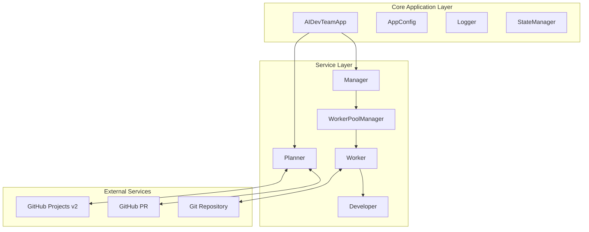
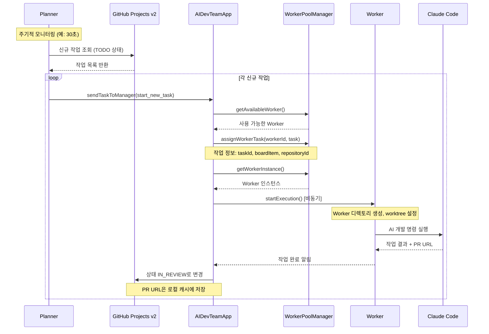
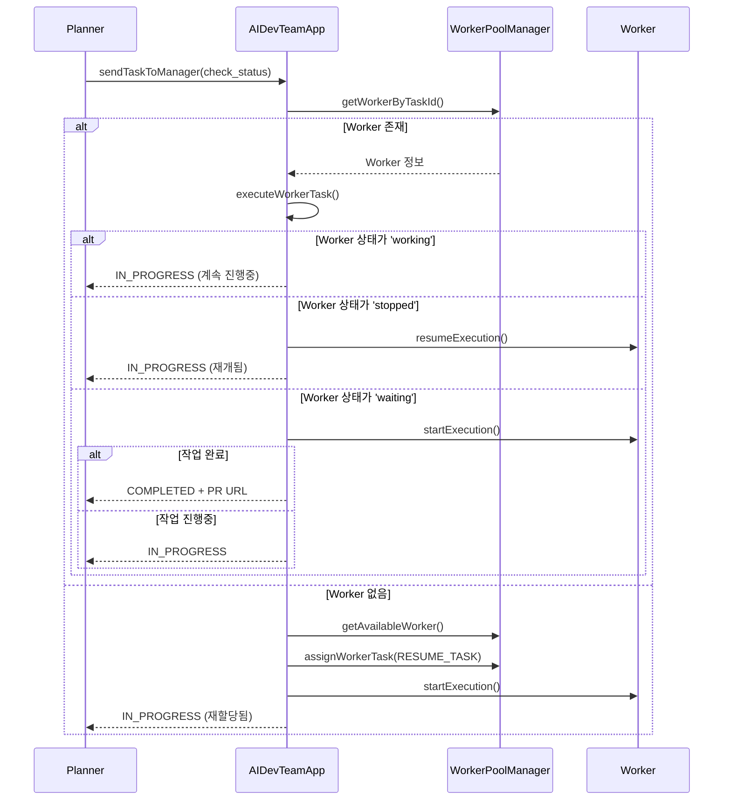
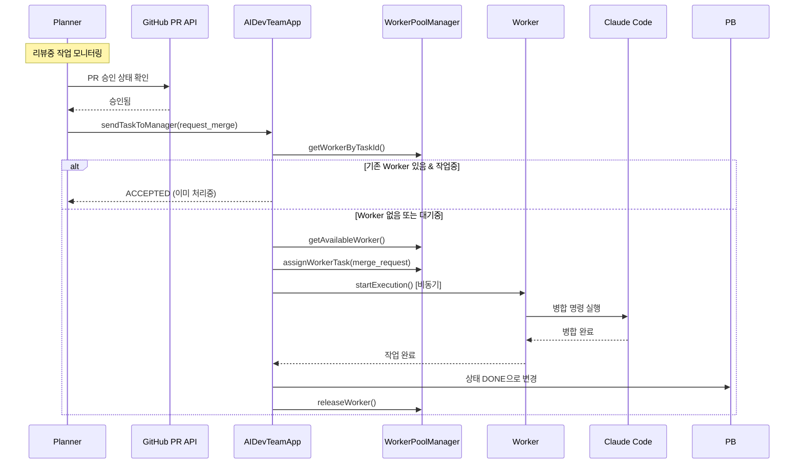

# AI DevTeam 구현 시나리오 문서

## 📋 개요
AI DevTeam 시스템의 PRD 시나리오를 기반으로 작성된 실제 구현 시나리오입니다. 주요 컴포넌트 간의 상호작용과 실제 코드 흐름을 상세히 설명합니다.

## 🏗️ 시스템 아키텍처



## 🎯 주요 구현 시나리오

### 1. 시스템 초기화 시나리오

#### 1-1. Application 초기화 순서
```typescript
// AIDevTeamApp.initialize() 메서드 기반
async initialize() {
  // 1. Logger 설정
  this.logger = new Logger(loggerConfig)
  
  // 2. StateManager 초기화 (상태 관리)
  this.stateManager = new StateManager(statePath)
  await this.stateManager.initialize()
  
  // 3. 외부 서비스 연결
  this.projectBoardService = serviceFactory.createProjectBoardService()
  this.pullRequestService = serviceFactory.createPullRequestService()
  
  // 4. 워크스페이스 관리자 초기화
  workspaceManager = new WorkspaceManager(config, dependencies)
  
  // 5. Worker Pool 관리자 초기화
  this.workerPoolManager = new WorkerPoolManager(config, dependencies)
  
  // 6. Planner 초기화 및 ManagerCommunicator 연결
  this.planner = new Planner(config, plannerDependencies)
}
```

#### 1-2. 시작 순서
```typescript
async start() {
  // 1. Worker Pool 초기화 (최소 Worker 수 생성)
  await this.workerPoolManager.initializePool()
  
  // 2. Planner 모니터링 시작
  await this.planner.startMonitoring()
  
  // 3. 상태 정보 출력
  console.log('Worker Pool:', activeWorkers/totalWorkers)
}
```

### 2. 신규 작업 처리 시나리오

#### 2-1. 작업 발견 및 할당


#### 2-2. Worker 작업 디렉토리 설정
```typescript
// Worker가 실제로 수행하는 작업 설정
class Worker {
  async setupWorkspace(task: WorkerTask) {
    // 1. 작업 디렉토리 생성 (repository + taskId)
    const workDir = `${repository}_${taskId}`
    
    // 2. Git worktree 생성 (브랜치명: taskId)
    await git.worktree.add(workDir, taskId)
    
    // 3. 로컬 지침 파일 생성 (CLAUDE.local.md)
    await fs.writeFile(`${workDir}/CLAUDE.local.md`, instructions)
    
    // 4. Developer에게 프롬프트 전달
    await developer.execute(prompt, workDir)
  }
}
```

### 3. 진행중 작업 관리 시나리오

#### 3-1. 작업 상태 확인 및 재개


### 4. 리뷰 처리 시나리오

#### 4-1. PR 승인 후 병합


#### 4-2. 피드백 처리
```typescript
// Planner에서 피드백 감지 및 처리
class Planner {
  async handleFeedback(taskId: string, comments: Comment[]) {
    // 1. 새로운 코멘트 필터링 (처리되지 않은 코멘트)
    const newComments = comments.filter(c => !c.processed)
    
    if (newComments.length > 0) {
      // 2. Manager에게 피드백 처리 요청
      const response = await managerCommunicator.sendTaskToManager({
        taskId,
        action: 'process_feedback',
        comments: newComments,
        pullRequestUrl,
        boardItem
      })
      
      // 3. 코멘트 처리 상태 업데이트
      await this.markCommentsAsProcessed(newComments)
    }
  }
}
```

### 5. Worker Pool 관리 시나리오

#### 5-1. Worker 생명주기 관리
```typescript
class WorkerPoolManager {
  async initializePool() {
    // 1. 최소 Worker 수만큼 생성
    for (let i = 0; i < this.config.minWorkers; i++) {
      const worker = await this.createWorker()
      this.workers.set(worker.id, worker)
    }
  }
  
  async getAvailableWorker(): Promise<Worker | null> {
    // 1. 유휴 상태 Worker 찾기
    const idleWorker = Array.from(this.workers.values())
      .find(w => w.status === 'idle')
    
    if (idleWorker) return idleWorker
    
    // 2. 최대 Worker 수 미만이면 새 Worker 생성
    if (this.workers.size < this.config.maxWorkers) {
      return await this.createWorker()
    }
    
    return null // 사용 가능한 Worker 없음
  }
  
  async releaseWorker(workerId: string) {
    const worker = this.workers.get(workerId)
    if (worker) {
      // Worker 상태 초기화
      worker.reset()
      worker.status = 'idle'
    }
  }
}
```

### 6. 동시성 제어 시나리오

#### 6-1. Git 동시성 제어
```typescript
// GitLockService를 통한 동일 저장소 동시 접근 제어
class GitLockService {
  private locks = new Map<string, Promise<void>>()
  
  async withLock<T>(repoId: string, operation: () => Promise<T>): Promise<T> {
    // 기존 작업이 있으면 대기
    const existingLock = this.locks.get(repoId)
    if (existingLock) {
      await existingLock
    }
    
    // 새로운 작업 실행
    const operationPromise = operation()
    this.locks.set(repoId, operationPromise.then(() => {}))
    
    try {
      return await operationPromise
    } finally {
      this.locks.delete(repoId)
    }
  }
}
```

#### 6-2. Worker 작업 동시성
```typescript
class Worker {
  async startExecution(): Promise<ExecutionResult> {
    if (this.status === 'working') {
      throw new Error('Worker is already executing')
    }
    
    this.status = 'working'
    
    try {
      // Git 락을 통한 안전한 저장소 접근
      return await this.gitLockService.withLock(this.repositoryId, async () => {
        await this.setupWorkspace()
        const result = await this.developer.execute()
        return this.processResult(result)
      })
    } finally {
      this.status = 'idle'
    }
  }
}
```

### 7. 오류 처리 및 복구 시나리오

#### 7-1. Worker 장애 복구
```typescript
// WorkerPoolManager의 자동 복구 메커니즘
class WorkerPoolManager {
  private async monitorWorkers() {
    setInterval(async () => {
      for (const [workerId, worker] of this.workers) {
        // 중지된 Worker 복구
        if (worker.status === 'stopped') {
          const stoppedDuration = Date.now() - worker.lastActivity
          
          if (stoppedDuration > this.config.workerRecoveryTimeoutMs) {
            this.logger.info('Recovering stopped worker', { workerId })
            worker.status = 'idle'
            worker.reset()
          }
        }
        
        // 응답 없는 Worker 재시작
        if (worker.status === 'working') {
          const workingDuration = Date.now() - worker.lastActivity
          
          if (workingDuration > this.config.workerTimeoutMs) {
            this.logger.warn('Restarting unresponsive worker', { workerId })
            await worker.forceStop()
            worker.status = 'idle'
          }
        }
      }
    }, 60000) // 1분마다 체크
  }
}
```

#### 7-2. 작업 실패 처리
```typescript
// AIDevTeamApp의 작업 실행 오류 처리
private async executeWorkerTask(workerId: string, request: TaskRequest) {
  try {
    const result = await workerInstance.startExecution()
    return { 
      success: result.success, 
      pullRequestUrl: result.pullRequestUrl 
    }
  } catch (executionError) {
    this.logger.error('Worker execution failed', {
      workerId, taskId: request.taskId, error: executionError.message
    })
    
    // Worker 자동 해제로 상태 동기화
    try {
      await this.workerPoolManager.releaseWorker(workerId)
    } catch (releaseError) {
      this.logger.warn('Failed to release worker after failure', {
        workerId, error: releaseError.message
      })
    }
    
    return { success: false }
  }
}
```

### 8. 상태 관리 및 모니터링

#### 8-1. 시스템 상태 조회
```typescript
// AIDevTeamApp 상태 모니터링
getStatus(): SystemStatus {
  const uptime = this.startedAt ? Date.now() - this.startedAt.getTime() : undefined
  
  return {
    isRunning: this.isRunning,
    plannerStatus: this.planner?.getStatus() || null,
    workerPoolStatus: this.workerPoolManager?.getPoolStatus() || null,
    startedAt: this.startedAt,
    uptime
  }
}

// Worker Pool 상태
getPoolStatus() {
  const workers = Array.from(this.workers.values())
  return {
    totalWorkers: workers.length,
    activeWorkers: workers.filter(w => w.status === 'working').length,
    idleWorkers: workers.filter(w => w.status === 'idle').length,
    stoppedWorkers: workers.filter(w => w.status === 'stopped').length,
    workers: workers.map(w => ({
      id: w.id,
      status: w.status,
      currentTask: w.currentTask?.taskId,
      lastActivity: w.lastActivity
    }))
  }
}
```

#### 8-2. Graceful Shutdown
```typescript
// 시스템 종료 시나리오
async stop() {
  // 1. Planner 모니터링 중지
  if (this.planner) {
    await this.planner.stopMonitoring()
  }
  
  // 2. 모든 Worker 작업 완료 대기
  if (this.workerPoolManager) {
    await this.workerPoolManager.shutdown()
  }
  
  // 3. 상태 초기화
  this.isRunning = false
  this.startedAt = undefined
}

// 신호 핸들러로 Graceful Shutdown 보장
setupSignalHandlers() {
  const signalHandler = (signal: string) => {
    this.stop()
      .then(() => process.exit(0))
      .catch(() => process.exit(1))
  }
  
  process.on('SIGTERM', () => signalHandler('SIGTERM'))
  process.on('SIGINT', () => signalHandler('SIGINT'))
}
```

## 🔧 구현 핵심 특징

### 1. 비동기 작업 처리
- Worker 작업을 비동기로 실행하여 Planner 응답성 확보
- Promise 기반 결과 처리로 완료 알림 자동화

### 2. 상태 동기화
- StateManager를 통한 영구 상태 저장
- Worker Pool의 실시간 상태 관리
- 작업별 메타데이터 추적

### 3. 오류 복구
- Worker 장애 자동 감지 및 복구
- 작업 재할당 메커니즘
- Graceful shutdown 지원

### 4. 확장성
- 동적 Worker Pool 크기 조절
- 플러그인형 Developer 지원 (Claude Code, Gemini CLI)
- 다양한 프로젝트 보드 지원 준비 (GitHub → Jira, Notion)

### 5. 모니터링
- 상세한 로깅 및 상태 추적
- 실시간 성능 메트릭
- 디버깅을 위한 컨텍스트 정보 보존

## 📊 성능 특성

### 모니터링 간격
- Planner 주기: 30초 (설정 가능)
- Worker 상태 체크: 1분
- 작업 타임아웃: 30분 (설정 가능)

### 리소스 사용
- 최소 Worker 수: 2개 (설정 가능)
- 최대 Worker 수: 5개 (설정 가능)
- 메모리: 작업당 ~100MB (워크트리 포함)

### 응답성
- 신규 작업 감지: 최대 30초
- 작업 완료 처리: 즉시
- 피드백 반영: 최대 30초

이 문서는 PRD의 이론적 시나리오를 실제 구현된 코드의 동작과 매핑하여 시스템의 실제 작동 방식을 이해할 수 있도록 작성되었습니다.