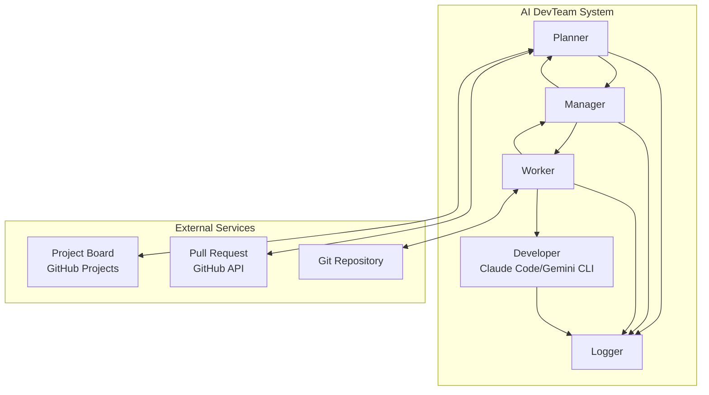
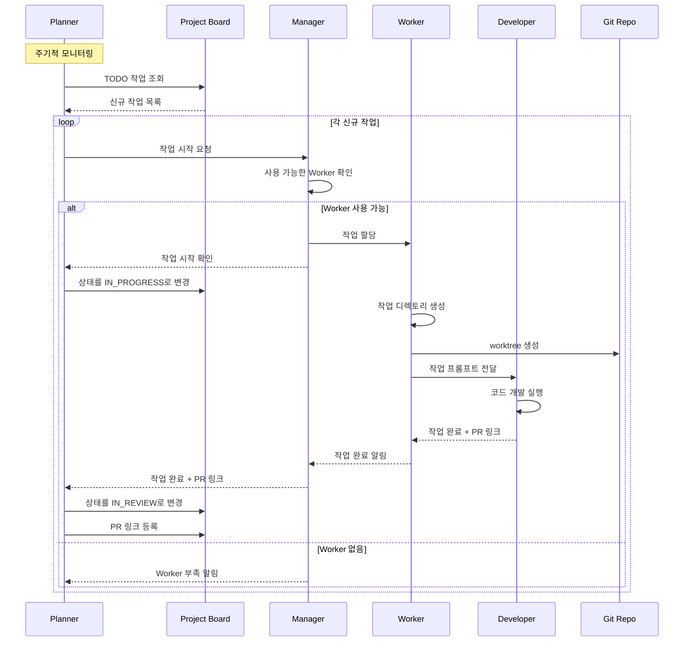
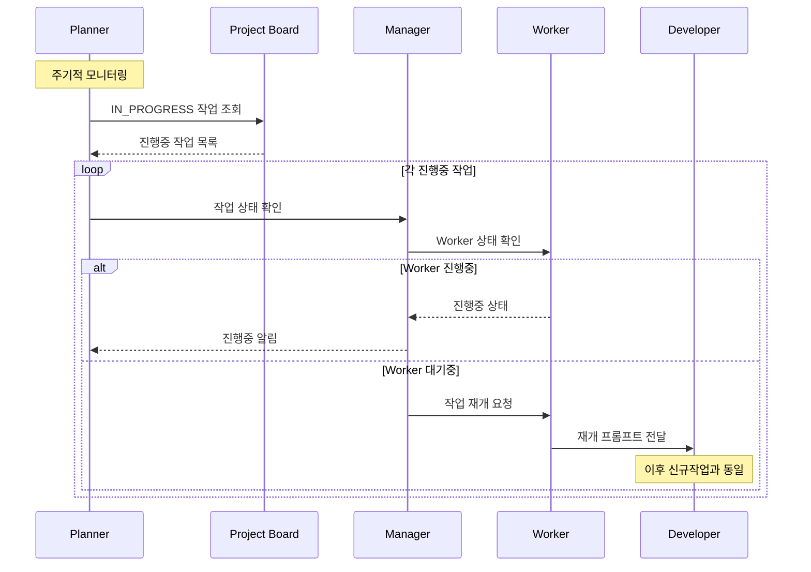
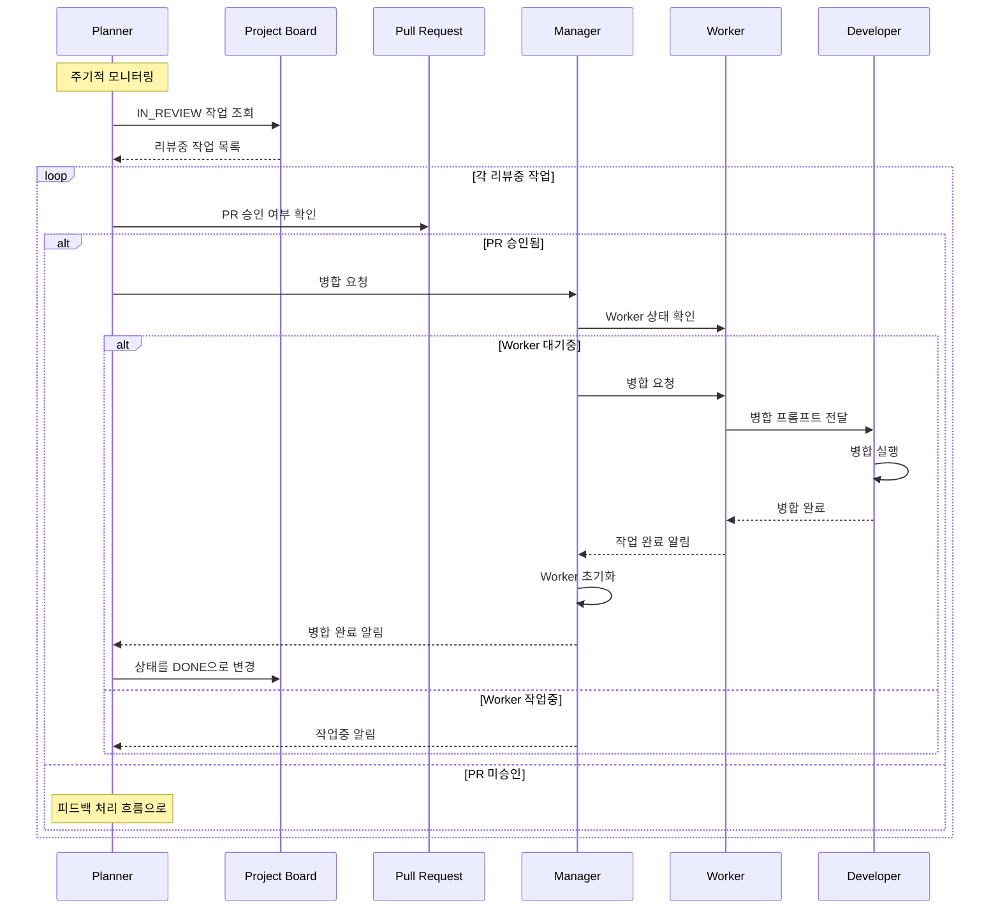
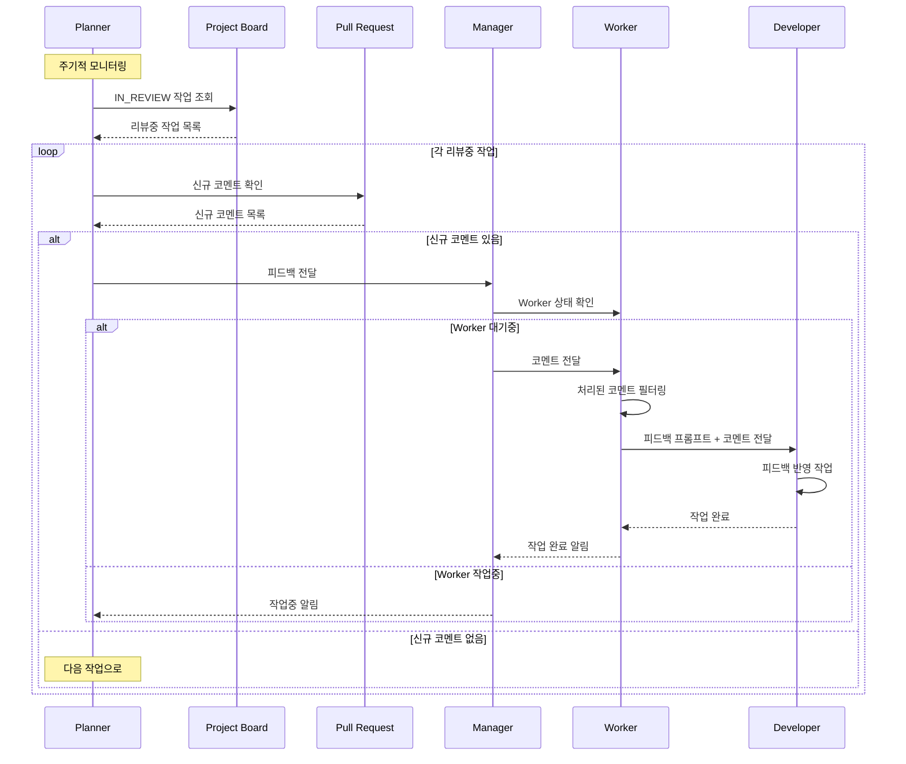

# PRD 설계 흐름도

## 전체 시스템 아키텍처

## 주요 컴포넌트 역할

### 1. Planner
- 프로젝트 보드 모니터링 (주기적)
- 작업 상태 관리 (TODO → IN_PROGRESS → IN_REVIEW → DONE)
- PR 승인/피드백 처리
- Manager와 통신

### 2. Manager
- 워크스페이스 관리
- Worker Pool 관리 (최소/최대 Worker 수)
- Worker에 작업 할당
- Worker 상태 관리

### 3. Worker
- 작업 디렉토리 생성
- Git worktree 관리
- Developer에게 프롬프트 전달
- 작업 결과 처리

### 4. Developer
- AI 개발자 (Claude Code, Gemini CLI)
- 실제 코드 작성 및 개발 작업 수행

## 작업 흐름 시나리오

### 신규 작업 흐름

### 진행중 작업 흐름

### 리뷰중 작업 흐름 - 승인

### 리뷰중 작업 흐름 - 피드백

## 시스템 정책

### Worker Pool 관리
- Worker는 하나의 작업만 처리
- 최소/최대 Worker 수 설정
- 중지된 Worker는 특정 시간 후 대기 상태로 전환

### 동시성 처리
- 동일 저장소의 git fetch, worktree add 동시 요청 고려
- Worker Pool을 통한 리소스 관리

### 상태관리
- JSON 파일 기반 메타데이터 저장
- 향후 DB 확장 가능한 구조

## 기술 스택
- **Project Board**: GitHub Projects (기본), 향후 Jira/Notion 확장
- **Source Control**: Git, GitHub API, GitHub CLI
- **AI Developer**: Claude Code, Gemini CLI
- **State Storage**: JSON 파일, 향후 DB 확장
- **Logging**: 시스템 로깅 서비스